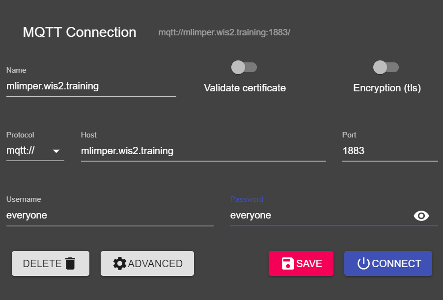
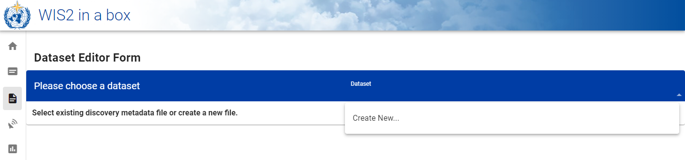
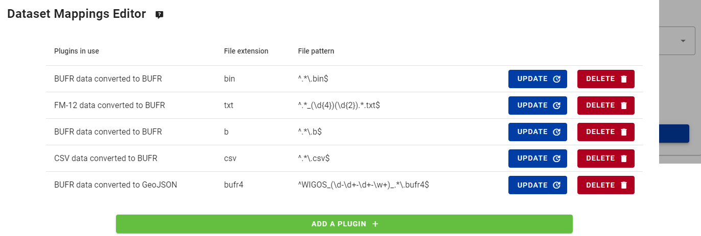

# Konfigurieren von Datensätzen in wis2box

!!! abstract "Lernergebnisse"
    Am Ende dieser praktischen Sitzung werden Sie in der Lage sein:

    - einen neuen Datensatz zu erstellen
    - Entdeckungsmetadaten für einen Datensatz zu erstellen
    - Datenzuordnungen für einen Datensatz zu konfigurieren
    - eine WIS2-Benachrichtigung mit einem WCMP2-Datensatz zu veröffentlichen
    - Ihren Datensatz zu aktualisieren und erneut zu veröffentlichen

## Einführung

wis2box verwendet Datensätze, die mit Entdeckungsmetadaten und Datenzuordnungen verknüpft sind.

Entdeckungsmetadaten werden verwendet, um einen WCMP2 (WMO Core Metadata Profile 2) Datensatz zu erstellen, der mittels einer WIS2-Benachrichtigung, die auf Ihrem wis2box-Broker veröffentlicht wird, geteilt wird.

Die Datenzuordnungen werden verwendet, um ein Daten-Plugin mit Ihren Eingabedaten zu verknüpfen, sodass Ihre Daten vor der Veröffentlichung mittels der WIS2-Benachrichtigung transformiert werden können.

Diese Sitzung führt Sie durch das Erstellen eines neuen Datensatzes, das Erstellen von Entdeckungsmetadaten und das Konfigurieren von Datenzuordnungen. Sie werden Ihren Datensatz in der wis2box-API überprüfen und die WIS2-Benachrichtigung für Ihre Entdeckungsmetadaten überprüfen.

## Vorbereitung

Verbinden Sie sich mit Ihrem Broker über MQTT Explorer.

Verwenden Sie anstelle Ihrer internen Broker-Anmeldeinformationen die öffentlichen Anmeldeinformationen `everyone/everyone`:



!!! Hinweis

    Sie sollten niemals die Anmeldeinformationen Ihres internen Brokers mit externen Benutzern teilen. Der Benutzer 'everyone' ist ein öffentlicher Benutzer, um das Teilen von WIS2-Benachrichtigungen zu ermöglichen.

    Die Anmeldeinformationen `everyone/everyone` haben nur Lesezugriff auf das Thema 'origin/a/wis2/#'. Dies ist das Thema, auf dem die WIS2-Benachrichtigungen veröffentlicht werden. Der Global Broker kann sich mit diesen öffentlichen Anmeldeinformationen anmelden, um die Benachrichtigungen zu erhalten.
    
    Der Benutzer 'everyone' wird keine internen Themen sehen oder Nachrichten veröffentlichen können.
    
Öffnen Sie einen Browser und eine Seite zu `http://<your-host>/wis2box-webapp`. Stellen Sie sicher, dass Sie angemeldet sind und auf die Seite 'Datensatz-Editor' zugreifen können.

Siehe den Abschnitt über [Initialisierung von wis2box](/practical-sessions/initializing-wis2box), wenn Sie sich daran erinnern müssen, wie man sich mit dem Broker verbindet oder auf die wis2box-Webapp zugreift.

## Erstellen eines Autorisierungstokens für Prozesse/wis2box

Sie benötigen ein Autorisierungstoken für den Endpunkt 'processes/wis2box', um Ihren Datensatz zu veröffentlichen.

Um ein Autorisierungstoken zu erstellen, greifen Sie über SSH auf Ihre Trainings-VM zu und verwenden Sie die folgenden Befehle, um sich im wis2box-Management-Container anzumelden:

```bash
cd ~/wis2box-1.0.0rc1
python3 wis2box-ctl.py login
```

Führen Sie dann den folgenden Befehl aus, um ein zufällig generiertes Autorisierungstoken für den Endpunkt 'processes/wis2box' zu erstellen:

```bash
wis2box auth add-token --path processes/wis2box
```

Sie können auch ein Token mit einem spezifischen Wert erstellen, indem Sie das Token als Argument für den Befehl bereitstellen:

```bash
wis2box auth add-token --path processes/wis2box MyS3cretToken
```

Stellen Sie sicher, dass Sie den Tokenwert kopieren und auf Ihrem lokalen Rechner speichern, da Sie ihn später benötigen werden.

Sobald Sie Ihr Token haben, können Sie den wis2box-Management-Container verlassen:

```bash
exit
```

## Erstellen eines neuen Datensatzes in der wis2box-Webapp

Navigieren Sie auf der wis2box-Webapp Ihrer wis2box-Instanz zur Seite 'Datensatz-Editor', indem Sie zu `http://<your-host>/wis2box-webapp` gehen und 'Datensatz-Editor' aus dem Menü auf der linken Seite auswählen.

Auf der Seite 'Datensatz-Editor' klicken Sie unter dem Tab 'Datensätze' auf "Neu erstellen ...":



Ein Popup-Fenster erscheint und fordert Sie auf, Folgendes anzugeben:

- **Zentrum-ID**: Dies ist das Akronym der Agentur (in Kleinbuchstaben und ohne Leerzeichen), wie es vom WMO-Mitglied angegeben wurde, das das Datenzentrum identifiziert, das für die Veröffentlichung der Daten verantwortlich ist.
- **Datentyp**: Der Datentyp, für den Sie Metadaten erstellen. Sie können zwischen der Verwendung einer vordefinierten Vorlage oder der Auswahl von 'andere' wählen. Wenn 'andere' ausgewählt wird, müssen weitere Felder manuell ausgefüllt werden.

!!! Hinweis "Zentrum-ID"

    Ihre Zentrum-ID sollte mit der TLD Ihres Landes beginnen, gefolgt von einem Bindestrich (`-`) und einem abgekürzten Namen Ihrer Organisation (zum Beispiel `de-dwd`). Die Zentrum-ID muss in Kleinbuchstaben sein und darf nur alphanumerische Zeichen verwenden. Die Dropdown-Liste zeigt alle derzeit auf WIS2 registrierten Zentrum-IDs sowie jede Zentrum-ID, die Sie bereits in wis2box erstellt haben.

!!! Hinweis "Datentypvorlagen"

    Das Feld *Datentyp* ermöglicht es Ihnen, aus einer Liste von Vorlagen auszuwählen, die im Datensatz-Editor der wis2box-Webapp verfügbar sind. Eine Vorlage füllt das Formular mit vorgeschlagenen Standardwerten aus, die für den Datentyp geeignet sind. Dies umfasst vorgeschlagene Titel und Schlüsselwörter für die Metadaten und vorkonfigurierte Daten-Plugins. Das Thema wird auf das Standardthema für den Datentyp festgelegt.

    Zum Zwecke des Trainings werden wir den Datentyp *weather/surface-based-observations/synop* verwenden, der Daten-Plugins enthält, die sicherstellen, dass die Daten vor der Veröffentlichung in das BUFR-Format umgewandelt werden.

    Wenn Sie CAP-Warnungen über wis2box veröffentlichen möchten, verwenden Sie die Vorlage *weather/advisories-warnings*. Diese Vorlage enthält ein Daten-Plugin, das überprüft, ob die Eingabedaten eine gültige CAP-Warnung sind, bevor sie veröffentlicht wird. Um CAP-Warnungen zu erstellen und über wis2box zu veröffentlichen, können Sie [CAP Composer](https://github.com/wmo-raf/cap-composer) verwenden.

Bitte wählen Sie eine Zentrum-ID, die für Ihre Organisation geeignet ist.

Für **Datentyp** wählen Sie **weather/surface-based-observations/synop**:


Klicken Sie auf *Weiter zum Formular*, um fortzufahren. Ihnen wird nun das **Datensatz-Editor-Formular** präsentiert.

Da Sie den Datentyp **weather/surface-based-observations/synop** ausgewählt haben, wird das Formular mit einigen Anfangswerten, die sich auf diesen Datentyp beziehen, vorausgefüllt.

## Erstellen von Entdeckungsmetadaten

Das Datensatz-Editor-Formular ermöglicht es Ihnen, die Entdeckungsmetadaten für Ihren Datensatz bereitzustellen, die der wis2box-Management-Container verwenden wird, um einen WCMP2-Datensatz zu veröffentlichen.

Da Sie den Datentyp 'weather/surface-based-observations/synop' ausgewählt haben, wird das Formular mit einigen Standardwerten vorausgefüllt.

Bitte stellen Sie sicher, dass Sie die automatisch generierte 'Lokale ID' durch einen beschreibenden Namen für Ihren Datensatz ersetzen, z. B. 'synop-dataset-wis2training':


Überprüfen Sie den Titel und die Schlüsselwörter und aktualisieren Sie sie bei Bedarf und geben Sie eine Beschreibung für Ihren Datensatz an.

Beachten Sie, dass es Optionen gibt, die 'WMO-Datenrichtlinie' von 'core' auf 'empfohlen' zu ändern oder Ihren Standard-Metadaten-Identifikator zu ändern. Bitte behalten Sie die Datenrichtlinie 'core' bei und verwenden Sie den Standard-Metadaten-Identifikator.

Als Nächstes überprüfen Sie den Abschnitt, der Ihre 'zeitlichen Eigenschaften' und 'räumlichen Eigenschaften' definiert. Sie können das Begrenzungsrechteck anpassen, indem Sie die Felder 'Nördliche Breite', 'Südliche Breite', 'Östliche Länge' und 'Westliche Länge' aktualisieren:


Füllen Sie als Nächstes den Abschnitt aus, der die 'Kontaktinformationen des Datenanbieters' definiert:


Füllen Sie schließlich den Abschnitt aus, der die 'Datenqualitätsinformationen' definiert:

Sobald Sie alle Abschnitte ausgefüllt haben, klicken Sie auf 'FORMULAR VALIDIEREN' und überprüfen Sie das Formular auf Fehler:


Wenn Fehler vorhanden sind, korrigieren Sie diese und klicken Sie erneut auf 'FORMULAR VALIDIEREN'.

Stellen Sie sicher, dass Sie keine Fehler haben und dass Sie eine Popup-Meldung erhalten, die besagt, dass Ihr Formular validiert wurde:


Als Nächstes überprüfen Sie vor dem Einreichen Ihres Datensatzes die Datenzuordnungen für Ihren Datensatz.

## Konfigurieren von Datenzuordnungen

Da Sie eine Vorlage verwendet haben, um Ihren Datensatz zu erstellen, wurden die Datenzuordnungen mit den Standard-Plugins für den Datentyp 'weather/surface-based-observations/synop' vorausgefüllt. Daten-Plugins werden in wis2box verwendet, um Daten zu transformieren, bevor sie mittels der WIS2-Benachrichtigung veröffentlicht werden.



Beachten Sie, dass Sie auf die Schaltfläche "aktualisieren" klicken können, um Einstellungen für das Plugin wie Dateierweiterung und das Dateimuster zu ändern. Sie können die Standardeinstellungen vorerst beibehalten. In einer späteren Sitzung werden Sie mehr über BUFR und die Transformation von Daten in das BUFR-Format erfahren.

## Einreichen Ihres Datensatzes

Schließlich können Sie auf 'einreichen' klicken, um Ihren Datensatz zu veröffentlichen.

Sie müssen das Autorisierungstoken für 'processes/wis2box' bereitstellen, das Sie zuvor erstellt haben. Wenn Sie dies noch nicht getan haben, können Sie ein neues Token erstellen, indem Sie den Anweisungen im Vorbereitungsbereich folgen.

Überprüfen Sie, dass Sie nach dem Einreichen Ihres Datensatzes die folgende Nachricht erhalten, die anzeigt, dass der Datensatz erfolgreich eingereicht wurde:


Nachdem Sie auf 'OK' geklickt haben, werden Sie zur Startseite des Datensatz-Editors weitergeleitet. Wenn Sie jetzt auf den Tab 'Datensatz' klicken, sollten Sie Ihren neuen Datensatz in der Liste sehen:


## Überprüfen der WIS2-Benachrichtigung für Ihre Entdeckungsmetadaten

Gehen Sie zu MQTT Explorer, wenn Sie mit dem Broker verbunden waren, sollten Sie eine neue WIS2-Benachrichtigung sehen, die auf dem Thema `origin/a/wis2/<your-centre-id>/metadata` veröffentlicht wurde:


Überprüfen Sie den Inhalt der WIS2-Benachrichtigung, die Sie veröffentlicht haben. Sie sollten ein JSON mit einer Struktur sehen, die dem WIS Notification Message (WNM)-Format entspricht.

!!! Frage

    Auf welchem Thema wird die WIS2-Benachrichtigung veröffentlicht?

??? Erfolg "Klicken Sie, um die Antwort zu sehen"

    Die WIS2-Benachrichtigung wird auf dem Thema `origin/a/wis2/<your-centre-id>/metadata` veröffentlicht.

!!! Frage
    
    Versuchen Sie, den Titel, die Beschreibung und die Schlüsselwörter, die Sie in den Entdeckungsmetadaten angegeben haben, in der WIS2-Benachrichtigung zu finden. Können Sie sie finden?

??? Erfolg "Klicken Sie, um die Antwort zu sehen"

    Beachten Sie, dass der Titel, die Beschreibung und die Schlüsselwörter, die Sie in den Entdeckungsmetadaten angegeben haben, **nicht** im Payload der WIS2-Benachrichtigung enthalten sind! 
    
    Stattdessen versuchen Sie, den kanonischen Link im Abschnitt "links" in der WIS2-Benachrichtigung zu finden:

    

    Die WIS2-Benachrichtigung enthält einen kanonischen Link zum veröffentlichten WCMP2-Datensatz. Wenn Sie diesen Link in einen Browser kopieren und einfügen, werden Sie den WCMP2-Datensatz herunterladen und den Titel, die Beschreibung und die Schlüsselwörter sehen, die Sie angegeben haben.

## Schlussfolgerung

!!! Erfolg "Herzlichen Glückwunsch!"
    In dieser praktischen Sitzung haben Sie gelernt, wie man:

    - einen neuen Datensatz erstellt
    - Entdeckungsmetadaten definiert
    - Datenzuordnungen überprüft
    - Entdeckungsmetadaten veröffentlicht
    - die WIS2-Benachrichtigung für Ihre Entdeckungsmetadaten überprüft