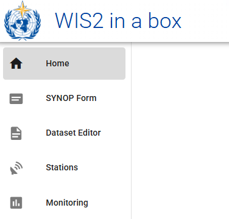
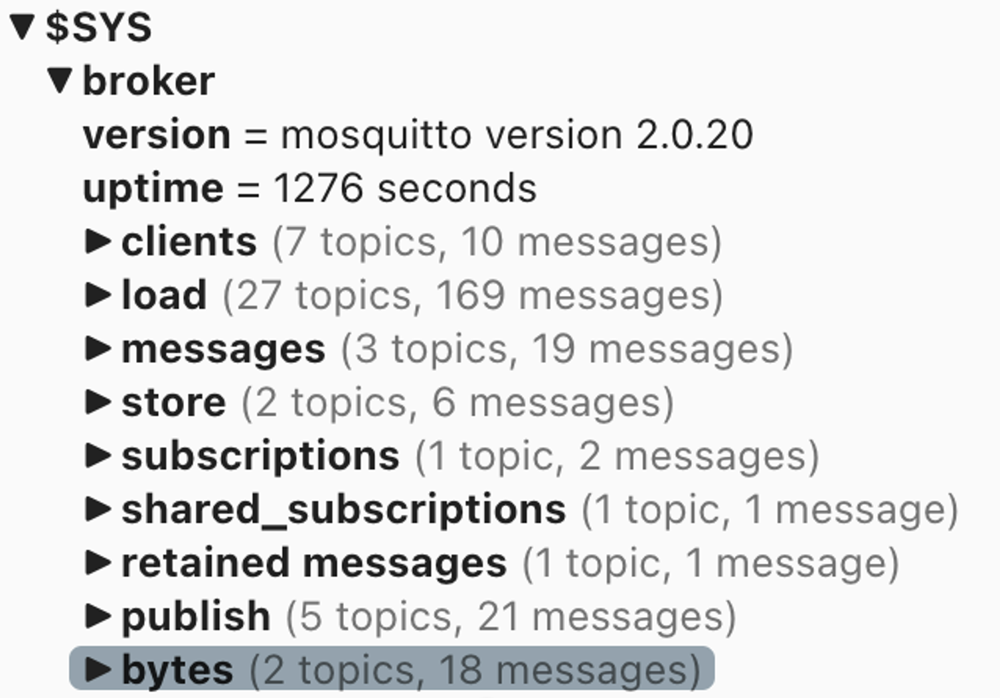

# Initialisierung von wis2box

!!! abstract "Lernergebnisse"

    Am Ende dieser praktischen Sitzung werden Sie in der Lage sein:

    - das Skript `wis2box-create-config.py` auszuführen, um die anfängliche Konfiguration zu erstellen
    - wis2box zu starten und den Status seiner Komponenten zu überprüfen
    - auf die **wis2box-webapp**, API, MinIO UI und das Grafana-Dashboard in einem Browser zuzugreifen
    - sich mit dem lokalen **wis2box-broker** unter Verwendung von MQTT Explorer zu verbinden

!!! note

    Die aktuellen Schulungsmaterialien verwenden wis2box-1.0.0rc1.
    
    Siehe [Zugriff auf Ihre Studenten-VM](accessing-your-student-vm.md) für Anweisungen zum Herunterladen und Installieren des wis2box-Software-Stacks, wenn Sie diese Schulung außerhalb einer lokalen Schulungssitzung durchführen.

## Vorbereitung

Melden Sie sich mit Ihrem Benutzernamen und Passwort an Ihrer zugewiesenen VM an und stellen Sie sicher, dass Sie sich im Verzeichnis `wis2box-1.0.0rc1` befinden:

```bash
cd ~/wis2box-1.0.0rc1
```

## Erstellung der anfänglichen Konfiguration

Die anfängliche Konfiguration für die wis2box erfordert:

- eine Umgebungsdatei `wis2box.env` mit den Konfigurationsparametern
- ein Verzeichnis auf dem Host-Computer, das zwischen dem Host-Computer und den wis2box-Containern geteilt wird, definiert durch die Umgebungsvariable `WIS2BOX_HOST_DATADIR`

Das Skript `wis2box-create-config.py` kann verwendet werden, um die anfängliche Konfiguration Ihrer wis2box zu erstellen.

Es wird Ihnen eine Reihe von Fragen stellen, um Ihre Konfiguration einzurichten.

Sie können die Konfigurationsdateien überprüfen und aktualisieren, nachdem das Skript abgeschlossen ist.

Führen Sie das Skript wie folgt aus:

```bash
python3 wis2box-create-config.py
```

### wis2box-host-data-Verzeichnis

Das Skript wird Sie bitten, das Verzeichnis für die Umgebungsvariable `WIS2BOX_HOST_DATADIR` einzugeben.

Beachten Sie, dass Sie den vollständigen Pfad zu diesem Verzeichnis angeben müssen.

Zum Beispiel, wenn Ihr Benutzername `username` ist, ist der vollständige Pfad zum Verzeichnis `/home/username/wis2box-data`:

```{.copy}
username@student-vm-username:~/wis2box-1.0.0rc1$ python3 wis2box-create-config.py
Bitte geben Sie das Verzeichnis an, das für WIS2BOX_HOST_DATADIR verwendet werden soll:
/home/username/wis2box-data
Das Verzeichnis, das für WIS2BOX_HOST_DATADIR verwendet wird, wird auf folgendes festgelegt:
    /home/username/wis2box-data
Ist das korrekt? (j/n/exit)
j
Das Verzeichnis /home/username/wis2box-data wurde erstellt.
```

### wis2box URL

Als Nächstes werden Sie gebeten, die URL für Ihre wis2box einzugeben. Dies ist die URL, die verwendet wird, um auf die wis2box-Webanwendung, API und UI zuzugreifen.

Bitte verwenden Sie `http://<Ihr-Hostname-oder-IP>` als URL.

```{.copy}
Bitte geben Sie die URL der wis2box ein:
 Für lokale Tests ist die URL http://localhost
 Um den Fernzugriff zu ermöglichen, sollte die URL auf die öffentliche IP-Adresse oder den Domainnamen des Servers zeigen, der die wis2box hostet.
http://username.wis2.training
Die URL der wis2box wird auf folgendes festgelegt:
  http://username.wis2.training
Ist das korrekt? (j/n/exit)
```

### WEBAPP-, STORAGE- und BROKER-Passwörter

Sie können die Option der zufälligen Passwortgenerierung wählen, wenn Sie nach `WIS2BOX_WEBAPP_PASSWORD`, `WIS2BOX_STORAGE_PASSWORD`, `WIS2BOX_BROKER_PASSWORD` gefragt werden und Ihr eigenes definieren.

Machen Sie sich keine Sorgen, sich diese Passwörter zu merken, sie werden in der Datei `wis2box.env` in Ihrem Verzeichnis wis2box-1.0.0rc1 gespeichert.

### Überprüfung von `wis2box.env`

Nachdem das Skript abgeschlossen ist, überprüfen Sie den Inhalt der Datei `wis2box.env` in Ihrem aktuellen Verzeichnis:

```bash
cat ~/wis2box-1.0.0rc1/wis2box.env
```

Oder überprüfen Sie den Inhalt der Datei über WinSCP.

!!! question

    Welcher Wert steht für WISBOX_BASEMAP_URL in der Datei wis2box.env?

??? success "Klicken, um die Antwort zu enthüllen"

    Der Standardwert für WIS2BOX_BASEMAP_URL ist `https://{s}.tile.openstreetmap.org/{z}/{x}/{y}.png`.

    Diese URL bezieht sich auf den OpenStreetMap-Tile-Server. Wenn Sie einen anderen Kartenanbieter verwenden möchten, können Sie diese URL ändern, um auf einen anderen Tile-Server zu zeigen.

!!! question 

    Welcher Wert steht für die Umgebungsvariable WIS2BOX_STORAGE_DATA_RETENTION_DAYS in der Datei wis2box.env?

??? success "Klicken, um die Antwort zu enthüllen"

    Der Standardwert für WIS2BOX_STORAGE_DATA_RETENTION_DAYS beträgt 30 Tage. Sie können diesen Wert ändern, wenn Sie möchten.
    
    Der wis2box-management-Container führt täglich einen Cronjob aus, um Daten, die älter als die durch WIS2BOX_STORAGE_DATA_RETENTION_DAYS definierte Anzahl von Tagen sind, aus dem `wis2box-public`-Bucket und dem API-Backend zu entfernen:
    
    ```{.copy}
    0 0 * * * su wis2box -c "wis2box data clean --days=$WIS2BOX_STORAGE_DATA_RETENTION_DAYS"
    ```

!!! note

    Die Datei `wis2box.env` enthält Umgebungsvariablen, die die Konfiguration Ihrer wis2box definieren. Weitere Informationen finden Sie in der [wis2box-Dokumentation](https://docs.wis2box.wis.wmo.int/en/latest/reference/configuration.html).

    Bearbeiten Sie die Datei `wis2box.env` nicht, es sei denn, Sie sind sicher, was Sie ändern. Falsche Änderungen können dazu führen, dass Ihre wis2box nicht mehr funktioniert.

    Teilen Sie den Inhalt Ihrer Datei `wis2box.env` nicht mit anderen, da sie sensible Informationen wie Passwörter enthält.


## Starten von wis2box

Stellen Sie sicher, dass Sie sich im Verzeichnis befinden, das die Definitionsdateien des wis2box-Software-Stacks enthält:

```{.copy}
cd ~/wis2box-1.0.0rc1
```

Starten Sie wis2box mit dem folgenden Befehl:

```{.copy}
python3 wis2box-ctl.py start
```

Wenn Sie diesen Befehl zum ersten Mal ausführen, sehen Sie die folgende Ausgabe:

```
Keine docker-compose.images-*.yml-Dateien gefunden, eine wird erstellt
Aktuelle Version=Undefined, neueste Version=1.0.0rc1
Möchten Sie aktualisieren? (j/n/exit)
```

Wählen Sie ``j`` und das Skript wird die Datei ``docker-compose.images-1.0.0rc1.yml`` erstellen, die erforderlichen Docker-Images herunterladen und die Dienste starten.

Das Herunterladen der Bilder kann je nach Geschwindigkeit Ihrer Internetverbindung einige Zeit in Anspruch nehmen. Dieser Schritt ist nur beim ersten Start von wis2box erforderlich.

Überprüfen Sie den Status mit dem folgenden Befehl:

```{.copy}
python3 wis2box-ctl.py status
```

Wiederholen Sie diesen Befehl, bis alle Dienste laufen.

!!! note "wis2box und Docker"
    wis2box wird als eine Reihe von Docker-Containern ausgeführt, die von docker-compose verwaltet werden.
    
    Die Dienste sind in den verschiedenen `docker-compose*.yml` definiert, die im Verzeichnis `~/wis2box-1.0.0rc1/` zu finden sind.
    
    Das Python-Skript `wis2box-ctl.py` wird verwendet, um die zugrunde liegenden Docker Compose-Befehle auszuführen, die die wis2box-Dienste steuern.

    Sie müssen die Details der Docker-Container nicht kennen, um den wis2box-Software-Stack auszuführen, aber Sie können die `docker-compose*.yml`- und Dateien einsehen, um zu sehen, wie die Dienste definiert sind. Wenn Sie mehr über Docker erfahren möchten, finden Sie weitere Informationen in der [Docker-Dokumentation](https://docs.docker.com/).

Um sich beim wis2box-management-Container anzumelden, verwenden Sie den folgenden Befehl:

```{.copy}
python3 wis2box-ctl.py login
```

Im wis2box-management-Container können Sie verschiedene Befehle ausführen, um Ihre wis2box zu verwalten, wie zum Beispiel:

- `wis2box auth add-token --path processes/wis2box` : um ein Autorisierungstoken für den Endpunkt `processes/wis2box` zu erstellen
- `wis2box data clean --days=<Anzahl-der-Tage>` : um Daten, die älter als eine bestimmte Anzahl von Tagen sind, aus dem `wis2box-public`-Bucket zu bereinigen

Um den Container zu verlassen und zum Host-Computer zurückzukehren, verwenden Sie den folgenden Befehl:

```{.copy}
exit
```

Führen Sie den folgenden Befehl aus, um die auf Ihrem Host-Computer laufenden Docker-Container zu sehen:

```{.copy}
docker ps
```

Sie sollten die folgenden Container laufen sehen:

- wis2box-management
- wis2box-api
- wis2box-minio
- wis2box-webapp
- wis2box-auth
- wis2box-ui
- wis2downloader
- elasticsearch
- elasticsearch-exporter
- nginx
- mosquitto
- prometheus
- grafana
- loki

Diese Container sind Teil des wis2box-Software-Stacks und bieten die verschiedenen Dienste, die zum Betrieb der wis2box erforderlich sind.

Führen Sie den folgenden Befehl aus, um die auf Ihrem Host-Computer laufenden Docker-Volumes zu sehen:

```{.copy}
docker volume ls
```

Sie sollten die folgenden Volumes sehen:

- wis2box_project_auth-data
- wis2box_project_es-data
- wis2box_project_htpasswd
- wis2box_project_minio-data
- wis2box_project_prometheus-data
- wis2box_project_loki-data

Sowie einige anonyme Volumes, die von den verschiedenen Containern verwendet werden.

Die Volumes, die mit `wis2box_project_` beginnen, werden verwendet, um persistente Daten für die verschiedenen Dienste im wis2box-Software-Stack zu speichern.

## wis2box API

Die wis2box enthält eine API (Application Programming Interface), die Datenzugriff und Prozesse für interaktive Visualisierung, Datentransformation und Veröffentlichung bereitstellt.

Öffnen Sie einen neuen Tab und navigieren Sie zur Seite `http://<Ihr-Host>/oapi`.


Dies ist die Startseite der wis2box-API (betrieben über den **wis2box-api**-Container).

!!! question
     
     Welche Sammlungen sind derzeit verfügbar?

??? success "Klicken, um die Antwort zu enthüllen"
    
    Um die derzeit über die API verfügbaren Sammlungen anzuzeigen, klicken Sie auf `View the collections in this service`:

    

    Die folgenden Sammlungen sind derzeit verfügbar:

    - Stationen
    - Datenbenachrichtigungen
    - Entdeckungsmetadaten


!!! question

    Wie viele Datenbenachrichtigungen wurden veröffentlicht?

??? success "Klicken, um die Antwort zu enthüllen"

    Klicken Sie auf "Datenbenachrichtigungen", dann klicken Sie auf `Browse through the items of "Data Notifications"`. 
    
    Sie werden feststellen, dass die Seite "Keine Elemente" anzeigt, da noch keine Datenbenachrichtigungen veröffentlicht wurden.

## wis2box webapp

Öffnen Sie einen Webbrowser und besuchen Sie die Seite `http://<Ihr-Host>/wis2box-webapp`.

Es erscheint ein Pop-up, das nach Ihrem Benutzernamen und Passwort fragt. Verwenden Sie den Standardbenutzernamen `wis2box-user` und das in der Datei `wis2box.env` definierte `WIS2BOX_WEBAPP_PASSWORD` und klicken Sie auf "Anmelden":

!!! note 

    Überprüfen Sie Ihre wis2box.env auf den Wert Ihres WIS2BOX_WEBAPP_PASSWORD. Sie können den folgenden Befehl verwenden, um den Wert dieser Umgebungsvariablen zu überprüfen:

    ```{.copy}
    cat ~/wis2box-1.0.0rc1/wis2box.env | grep WIS2BOX_WEBAPP_PASSWORD
    ```

Nachdem Sie sich angemeldet haben, bewegen Sie die Maus zum Menü auf der linken Seite, um die verfügbaren Optionen in der wis2box-Webanwendung zu sehen:



Dies ist die wis2box-Webanwendung, die es Ihnen ermöglicht, mit Ihrer wis2box zu interagieren:

- Erstellen und Verwalten von Datensätzen
- Aktualisieren/Überprüfen Ihrer Stationsmetadaten
- ASCII- und CSV-Daten einlesen
- Benachrichtigungen überwachen, die auf Ihrem wis2box-broker veröffentlicht wurden

Wir werden diese Webanwendung in einer späteren Sitzung verwenden.

## wis2box-broker

Öffnen Sie den MQTT Explorer auf Ihrem Computer und bereiten Sie eine neue Verbindung vor, um sich mit Ihrem Broker zu verbinden (betrieben über den **wis2box-broker**-Container).

Klicken Sie auf `+`, um eine neue Verbindung hinzuzufügen:


Sie können auf die Schaltfläche 'ERWEITERT' klicken und überprüfen, ob Sie Abonnements für die folgenden Themen haben:

- `#`
- `$SYS/#`


!!! note

    Das Thema `#` ist ein Platzhalter-Abonnement, das alle Themen abonniert, die auf dem Broker veröffentlicht werden.

    Die unter dem `$SYS`-Thema veröffentlichten Nachrichten sind Systemnachrichten, die vom mosquitto-Dienst selbst veröffentlicht werden.

Verwenden Sie die folgenden Verbindungsdetails und ersetzen Sie den Wert von `<Ihr-Host>` durch Ihren Hostnamen und `<WIS2BOX_BROKER_PASSWORD>` durch den Wert aus Ihrer `wis2box.env`-Datei:

- **Protokoll: mqtt://**
- **Host: `<Ihr-Host>`**
- **Port: 1883**
- **Benutzername: wis2box**
- **Passwort: `<WIS2BOX_BROKER_PASSWORD>`**

!!! note 

    Sie können Ihre wis2box.env überprüfen, um den Wert Ihres WIS2BOX_BROKER_PASSWORD zu sehen. Sie können den folgenden Befehl verwenden, um den Wert dieser Umgebungsvariablen zu überprüfen:

    ```{.copy}
    cat ~/wis2box-1.0.0rc1/wis2box.env | grep WIS2BOX_BROKER_PASSWORD
    ```

    Beachten Sie, dass dies Ihr **interner** Broker-Passwort ist. Der Global Broker verwendet verschiedene (nur-Lese-) Anmeldeinformationen, um sich bei Ihrem Broker anzumelden. Teilen Sie dieses Passwort niemals mit jemandem.

Stellen Sie sicher, dass Sie auf "SPEICHERN" klicken, um Ihre Verbindungsdetails zu speichern.

Klicken Sie dann auf "VERBINDEN", um sich mit Ihrem **wis2box-broker** zu verbinden.


Nachdem Sie verbunden sind, überprüfen Sie, dass die internen mosquitto-Statistiken von Ihrem Broker unter dem `$SYS`-Thema veröffentlicht werden:



Lassen Sie den MQTT Explorer geöffnet, da wir ihn verwenden werden, um die auf dem Broker veröffentlichten Nachrichten zu überwachen.

## MinIO UI

Öffnen Sie einen Webbrowser und besuchen Sie die Seite `http://<Ihr-Host>:9001`:

<img alt="minio-ui.png" src