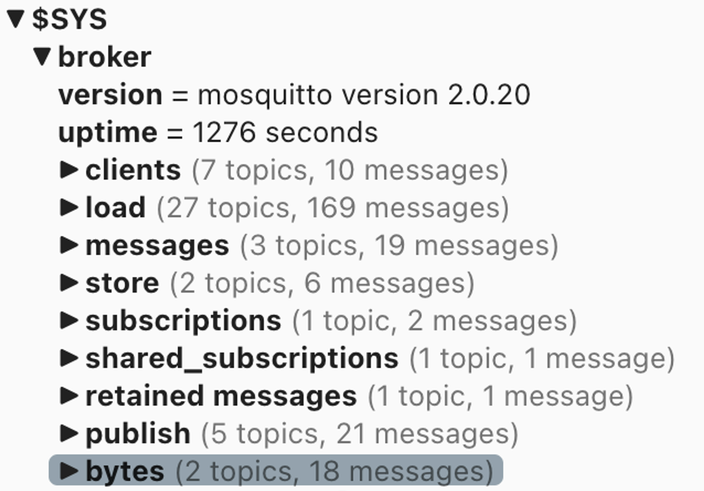

# Inicialización de wis2box

!!! abstract "Resultados de aprendizaje"

    Al final de esta sesión práctica, serás capaz de:

    - ejecutar el script `wis2box-create-config.py` para crear la configuración inicial
    - iniciar wis2box y verificar el estado de sus componentes
    - acceder a **wis2box-webapp**, API, MinIO UI y el tablero de Grafana en un navegador
    - conectarte al **wis2box-broker** local usando MQTT Explorer

!!! note

    Los materiales de formación actuales están utilizando wis2box-1.0.0rc1.
    
    Consulta [accessing-your-student-vm](accessing-your-student-vm.md) para instrucciones sobre cómo descargar e instalar el stack de software de wis2box si estás realizando esta formación fuera de una sesión de entrenamiento local.

## Preparación

Inicia sesión en tu VM designada con tu nombre de usuario y contraseña y asegúrate de estar en el directorio `wis2box-1.0.0rc1`:

```bash
cd ~/wis2box-1.0.0rc1
```

## Creación de la configuración inicial

La configuración inicial para el wis2box requiere:

- un archivo de entorno `wis2box.env` que contenga los parámetros de configuración
- un directorio en la máquina anfitriona para compartir entre la máquina anfitriona y los contenedores de wis2box definidos por la variable de entorno `WIS2BOX_HOST_DATADIR`

El script `wis2box-create-config.py` se puede utilizar para crear la configuración inicial de tu wis2box.

Te hará un conjunto de preguntas para ayudarte a configurar tu configuración.

Podrás revisar y actualizar los archivos de configuración después de que el script haya terminado.

Ejecuta el script de la siguiente manera:

```bash
python3 wis2box-create-config.py
```

### Directorio wis2box-host-data

El script te pedirá que ingreses el directorio que se utilizará para la variable de entorno `WIS2BOX_HOST_DATADIR`.

Ten en cuenta que necesitas definir la ruta completa a este directorio.

Por ejemplo, si tu nombre de usuario es `username`, la ruta completa al directorio es `/home/username/wis2box-data`:

```{.copy}
username@student-vm-username:~/wis2box-1.0.0rc1$ python3 wis2box-create-config.py
Por favor, ingresa el directorio que se utilizará para WIS2BOX_HOST_DATADIR:
/home/username/wis2box-data
El directorio que se utilizará para WIS2BOX_HOST_DATADIR se establecerá en:
    /home/username/wis2box-data
¿Es correcto? (s/n/salir)
s
El directorio /home/username/wis2box-data ha sido creado.
```

### URL de wis2box

A continuación, se te pedirá que ingreses la URL para tu wis2box. Esta es la URL que se utilizará para acceder a la aplicación web de wis2box, API y UI.

Por favor, utiliza `http://<tu-hostname-o-ip>` como la URL.

```{.copy}
Por favor, ingresa la URL de wis2box:
 Para pruebas locales la URL es http://localhost
 Para habilitar el acceso remoto, la URL debe apuntar a la dirección IP pública o nombre de dominio del servidor que aloja el wis2box.
http://username.wis2.training
La URL de wis2box se establecerá en:
  http://username.wis2.training
¿Es correcto? (s/n/salir)
```

### Contraseñas de WEBAPP, STORAGE y BROKER

Puedes usar la opción de generación de contraseña aleatoria cuando se te solicite y `WIS2BOX_WEBAPP_PASSWORD`, `WIS2BOX_STORAGE_PASSWORD`, `WIS2BOX_BROKER_PASSWORD` y definir la tuya propia.

No te preocupes por recordar estas contraseñas, estarán almacenadas en el archivo `wis2box.env` en tu directorio wis2box-1.0.0rc1.

### Revisar `wis2box.env`

Una vez que el script se haya completado, verifica el contenido del archivo `wis2box.env` en tu directorio actual:

```bash
cat ~/wis2box-1.0.0rc1/wis2box.env
```

O verifica el contenido del archivo a través de WinSCP.

!!! question

    ¿Cuál es el valor de WISBOX_BASEMAP_URL en el archivo wis2box.env?

??? success "Haz clic para revelar la respuesta"

    El valor predeterminado para WIS2BOX_BASEMAP_URL es `https://{s}.tile.openstreetmap.org/{z}/{x}/{y}.png`.

    Esta URL se refiere al servidor de mosaicos de OpenStreetMap. Si deseas usar un proveedor de mapas diferente, puedes cambiar esta URL para apuntar a un servidor de mosaicos diferente.

!!! question 

    ¿Cuál es el valor de la variable de entorno WIS2BOX_STORAGE_DATA_RETENTION_DAYS en el archivo wis2box.env?

??? success "Haz clic para revelar la respuesta"

    El valor predeterminado para WIS2BOX_STORAGE_DATA_RETENTION_DAYS es 30 días. Puedes cambiar este valor a un número diferente de días si lo deseas.
    
    El contenedor wis2box-management ejecuta un trabajo cron diariamente para eliminar datos más antiguos que el número de días definido por WIS2BOX_STORAGE_DATA_RETENTION_DAYS del bucket `wis2box-public` y del backend de la API:
    
    ```{.copy}
    0 0 * * * su wis2box -c "wis2box data clean --days=$WIS2BOX_STORAGE_DATA_RETENTION_DAYS"
    ```

!!! note

    El archivo `wis2box.env` contiene variables de entorno que definen la configuración de tu wis2box. Para más información consulta la [documentación de wis2box](https://docs.wis2box.wis.wmo.int/en/latest/reference/configuration.html).

    No edites el archivo `wis2box.env` a menos que estés seguro de los cambios que estás haciendo. Cambios incorrectos pueden hacer que tu wis2box deje de funcionar.

    No compartas el contenido de tu archivo `wis2box.env` con nadie, ya que contiene información sensible como contraseñas.

## Iniciar wis2box

Asegúrate de estar en el directorio que contiene los archivos de definición del stack de software de wis2box:

```{.copy}
cd ~/wis2box-1.0.0rc1
```

Inicia wis2box con el siguiente comando:

```{.copy}
python3 wis2box-ctl.py start
```

Cuando ejecutes este comando por primera vez, verás la siguiente salida:

```
No se encontraron archivos docker-compose.images-*.yml, creando uno
Versión actual=Indefinida, última versión=1.0.0rc1
¿Te gustaría actualizar? (s/n/salir)
```

Selecciona ``s`` y el script creará el archivo ``docker-compose.images-1.0.0rc1.yml``, descargará las imágenes Docker requeridas e iniciará los servicios.

La descarga de las imágenes puede tomar algún tiempo dependiendo de la velocidad de tu conexión a internet. Este paso solo es necesario la primera vez que inicias wis2box.

Inspecciona el estado con el siguiente comando:

```{.copy}
python3 wis2box-ctl.py status
```

Repite este comando hasta que todos los servicios estén en funcionamiento.

!!! note "wis2box y Docker"
    wis2box funciona como un conjunto de contenedores Docker gestionados por docker-compose.
    
    Los servicios están definidos en los diversos `docker-compose*.yml` que se pueden encontrar en el directorio `~/wis2box-1.0.0rc1/`.
    
    El script de Python `wis2box-ctl.py` se utiliza para ejecutar los comandos subyacentes de Docker Compose que controlan los servicios de wis2box.

    No necesitas conocer los detalles de los contenedores Docker para ejecutar el stack de software de wis2box, pero puedes inspeccionar los archivos `docker-compose*.yml` para ver cómo se definen los servicios. Si estás interesado en aprender más sobre Docker, puedes encontrar más información en la [documentación de Docker](https://docs.docker.com/).

Para iniciar sesión en el contenedor wis2box-management, utiliza el siguiente comando:

```{.copy}
python3 wis2box-ctl.py login
```

Dentro del contenedor wis2box-management puedes ejecutar varios comandos para gestionar tu wis2box, como:

- `wis2box auth add-token --path processes/wis2box` : para crear un token de autorización para el endpoint `processes/wis2box`
- `wis2box data clean --days=<número-de-días>` : para limpiar datos más antiguos que un cierto número de días del bucket `wis2box-public`

Para salir del contenedor y volver a la máquina anfitriona, utiliza el siguiente comando:

```{.copy}
exit
```

Ejecuta el siguiente comando para ver los contenedores docker que se están ejecutando en tu máquina anfitriona:

```{.copy}
docker ps
```

Deberías ver los siguientes contenedores en funcionamiento:

- wis2box-management
- wis2box-api
- wis2box-minio
- wis2box-webapp
- wis2box-auth
- wis2box-ui
- wis2downloader
- elasticsearch
- elasticsearch-exporter
- nginx
- mosquitto
- prometheus
- grafana
- loki

Estos contenedores son parte del stack de software de wis2box y proporcionan los diversos servicios necesarios para ejecutar el wis2box.

Ejecuta el siguiente comando para ver los volúmenes docker que se están ejecutando en tu máquina anfitriona:

```{.copy}
docker volume ls
```

Deberías ver los siguientes volúmenes:

- wis2box_project_auth-data
- wis2box_project_es-data
- wis2box_project_htpasswd
- wis2box_project_minio-data
- wis2box_project_prometheus-data
- wis2box_project_loki-data

Así como algunos volúmenes anónimos utilizados por los diversos contenedores.

Los volúmenes que comienzan con `wis2box_project_` se utilizan para almacenar datos persistentes para los diversos servicios en el stack de software de wis2box.

## API de wis2box

El wis2box contiene una API (Interfaz de Programación de Aplicaciones) que proporciona acceso a datos y procesos para visualización interactiva, transformación de datos y publicación.

Abre una nueva pestaña y navega a la página `http://<tu-host>/oapi`.


Esta es la página de inicio de la API de wis2box (ejecutada a través del contenedor **wis2box-api**).

!!! question
     
     ¿Qué colecciones están disponibles actualmente?

??? success "Haz clic para revelar la respuesta"
    
    Para ver las colecciones disponibles actualmente a través de la API, haz clic en `Ver las colecciones en este servicio`:

    

    Las siguientes colecciones están disponibles actualmente:

    - Estaciones
    - Notificaciones de datos
    - Metadatos de descubrimiento


!!! question

    ¿Cuántas notificaciones de datos han sido publicadas?

??? success "Haz clic para revelar la respuesta"

    Haz clic en "Notificaciones de datos", luego haz clic en `Explorar los elementos de "Notificaciones de Datos"`. 
    
    Notarás que la página dice "No hay elementos" ya que aún no se han publicado notificaciones de datos.

## Aplicación web de wis2box

Abre un navegador web y visita la página `http://<tu-host>/wis2box-webapp`.

Verás un pop-up pidiendo tu nombre de usuario y contraseña. Usa el nombre de usuario predeterminado `wis2box-user` y la `WIS2BOX_WEBAPP_PASSWORD` definida en el archivo `wis2box.env` y haz clic en "Iniciar sesión":

!!! note 

    Revisa tu wis2box.env para el valor de tu WIS2BOX_WEBAPP_PASSWORD. Puedes usar el siguiente comando para verificar el valor de esta variable de entorno:

    ```{.copy}
    cat ~/wis2box-1.0.0rc1/wis2box.env | grep WIS2BOX_WEBAPP_PASSWORD
    ```

Una vez que hayas iniciado sesión, mueve el ratón al menú de la izquierda para ver las opciones disponibles en la aplicación web de wis2box:


Esta es la aplicación web de wis2box que te permite interactuar con tu wis2box:

- crear y gestionar conjuntos de datos
- actualizar/revisar tus metadatos de estación
- ingerir datos ASCII y CSV
- monitorear notificaciones publicadas en tu wis2box-broker

Usaremos esta aplicación web en una sesión posterior.

## wis2box-broker

Abre el MQTT Explorer en tu computadora y prepara una nueva conexión para conectarte a tu broker (ejecutado a través del contenedor **wis2box-broker**).

Haz clic en `+` para agregar una nueva conexión:


Puedes hacer clic en el botón 'AVANZADO' y verificar que tienes suscripciones a los siguientes temas:

- `#`
- `$SYS/#`


!!! note

    El tema `#` es una suscripción comodín que se suscribirá a todos los temas publicados en el broker.

    Los mensajes publicados bajo el tema `$SYS` son mensajes del sistema publicados por el servicio mosquitto en sí.

Usa los siguientes detalles de conexión, asegurándote de reemplazar el valor de `<tu-host>` con tu nombre de host y `<WIS2BOX_BROKER_PASSWORD>` con el valor de tu archivo `wis2box.env`:

- **Protocolo: mqtt://**
- **Host: `<tu-host>`**
- **Puerto: 1883**
- **Nombre de usuario: wis2box**
- **Contraseña: `<WIS2BOX_BROKER_PASSWORD>`**

!!! note 

    Puedes verificar tu wis2box.env para el valor de tu WIS2BOX_BROKER_PASSWORD. Puedes usar el siguiente comando para verificar el valor de esta variable de entorno:

    ```{.copy}
    cat ~/wis2box-1.0.0rc1/wis2box.env | grep WIS2BOX_BROKER_PASSWORD
    ```

    Ten en cuenta que esta es tu contraseña **interna** del broker, el Broker Global utilizará diferentes credenciales (solo lectura) para suscribirse a tu broker. Nunca compartas esta contraseña con nadie.

Asegúrate de hacer clic en "GUARDAR" para almacenar los detalles de tu conexión.

Luego haz clic en "CONECTAR" para conectarte a tu **wis2box-broker**.


Una vez que estés conectado, verifica que las estadísticas internas de mosquitto estén siendo publicadas por tu broker bajo el tema `$SYS`:



Mantén el MQTT Explorer abierto, ya que lo usaremos para monitorear los mensajes publicados en el broker.

## Interfaz de usuario de MinIO

Abre un navegador web y visita la página `http://<tu-host>:9001`:


Esta es la interfaz de usuario de MinIO (ejecutada a través del contenedor **wis2box-storage**).

El nombre de usuario y la contraseña están definidos en el archivo `wis2box.env` en tu directorio de datos de wis2box por las variables de entorno `WIS2BOX_STORAGE_USERNAME` y `WIS2BOX_STORAGE_PASSWORD`. El nombre de usuario predeterminado es `wis2box`.

!!! note 

    Puedes verificar tu wis2box.env para el valor de tu WIS2BOX_STORAGE_PASSWORD. Puedes usar el siguiente comando para verificar el valor de esta variable de entorno:

    ```{.copy}
    cat ~/wis2box-1.0.0rc1/wis2box.env | grep WIS2BOX_STORAGE_PASSWORD
    ```

    Ten en cuenta que estas son las credenciales de lectura-escritura para tu instancia de MinIO. Nunca compartas estas credenciales con nadie. Los Servicios Globales solo pueden descargar datos de tu instancia de MinIO utilizando el proxy web en el bucket wis2box-public.

Intenta iniciar sesión en tu interfaz de usuario de MinIO. Verás que hay 3 buckets ya definidos:

- `wis2box-incoming`: utilizado para recibir datos entrantes
- `wis2box-public`: utilizado para almacenar datos que se ponen a disposición en las notificaciones WIS2, el contenido de este bucket se proxifica como `/data` en tu `WIS2BOX_URL` a través del contenedor nginx
- `wis2box-archive`: utilizado para archivar datos de `wis2box-incoming` diariamente


!!! note

    El contenedor