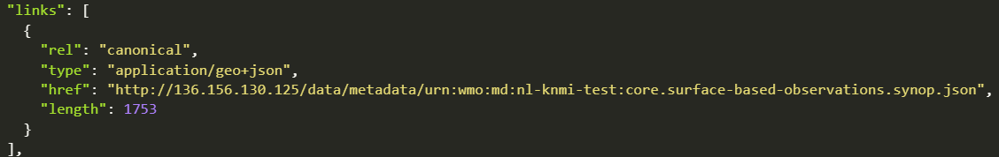

# Configuration des jeux de données dans wis2box

!!! abstract "Résultats d'apprentissage"
    À la fin de cette session pratique, vous serez capable de :

    - créer un nouveau jeu de données
    - créer des métadonnées de découverte pour un jeu de données
    - configurer les mappages de données pour un jeu de données
    - publier une notification WIS2 avec un enregistrement WCMP2
    - mettre à jour et republier votre jeu de données

## Introduction

wis2box utilise des jeux de données associés à des métadonnées de découverte et des mappages de données.

Les métadonnées de découverte sont utilisées pour créer un enregistrement WCMP2 (WMO Core Metadata Profile 2) qui est partagé via une notification WIS2 publiée sur votre wis2box-broker.

Les mappages de données sont utilisés pour associer un plugin de données à vos données d'entrée, permettant ainsi leur transformation avant publication via la notification WIS2.

Cette session vous guidera à travers la création d'un nouveau jeu de données, la création de métadonnées de découverte et la configuration des mappages de données. Vous inspecterez votre jeu de données dans l'API wis2box et passerez en revue la notification WIS2 pour vos métadonnées de découverte.

## Préparation

Connectez-vous à votre broker en utilisant MQTT Explorer.

Au lieu d'utiliser vos identifiants de broker internes, utilisez les identifiants publics `everyone/everyone` :


!!! Note

    Vous n'avez jamais besoin de partager les identifiants de votre broker interne avec des utilisateurs externes. L'utilisateur 'everyone' est un utilisateur public pour permettre le partage des notifications WIS2.

    Les identifiants `everyone/everyone` ont un accès en lecture seule sur le sujet 'origin/a/wis2/#'. C'est le sujet où les notifications WIS2 sont publiées. Le Global Broker peut s'abonner avec ces identifiants publics pour recevoir les notifications.
    
    L'utilisateur 'everyone' ne verra pas les sujets internes ni ne pourra publier de messages.
    
Ouvrez un navigateur et accédez à `http://<votre-hôte>/wis2box-webapp`. Assurez-vous d'être connecté et d'avoir accès à la page 'éditeur de jeux de données'.

Consultez la section sur [Initialisation de wis2box](/practical-sessions/initializing-wis2box) si vous avez besoin de vous rappeler comment vous connecter au broker ou accéder à la webapp wis2box.

## Créer un jeton d'autorisation pour processes/wis2box

Vous aurez besoin d'un jeton d'autorisation pour le point de terminaison 'processes/wis2box' pour publier votre jeu de données.

Pour créer un jeton d'autorisation, accédez à votre VM de formation via SSH et utilisez les commandes suivantes pour vous connecter au conteneur de gestion wis2box :

```bash
cd ~/wis2box-1.0.0rc1
python3 wis2box-ctl.py login
```

Ensuite, exécutez la commande suivante pour créer un jeton d'autorisation généré aléatoirement pour le point de terminaison 'processes/wis2box' :

```bash
wis2box auth add-token --path processes/wis2box
```

Vous pouvez également créer un jeton avec une valeur spécifique en fournissant le jeton comme argument à la commande :

```bash
wis2box auth add-token --path processes/wis2box MyS3cretToken
```

Assurez-vous de copier la valeur du jeton et de la stocker sur votre machine locale, car vous en aurez besoin plus tard.

Une fois que vous avez votre jeton, vous pouvez quitter le conteneur de gestion wis2box :

```bash
exit
```

## Création d'un nouveau jeu de données dans la webapp wis2box

Naviguez jusqu'à la page 'éditeur de jeux de données' dans la webapp wis2box de votre instance wis2box en allant à `http://<votre-hôte>/wis2box-webapp` et en sélectionnant 'éditeur de jeux de données' dans le menu sur le côté gauche.

Sur la page 'éditeur de jeux de données', sous l'onglet 'Jeux de données', cliquez sur "Créer Nouveau ..." :


Une fenêtre pop-up apparaîtra, vous demandant de fournir :

- **Centre ID** : c'est l'acronyme de l'agence (en minuscules et sans espaces), tel que spécifié par le membre de l'OMM, qui identifie le centre de données responsable de la publication des données.
- **Type de données** : Le type de données pour lequel vous créez des métadonnées. Vous pouvez choisir entre utiliser un modèle prédéfini ou sélectionner 'autre'. Si 'autre' est sélectionné, plus de champs devront être remplis manuellement.

!!! Note "Centre ID"

    Votre centre-id doit commencer par le TLD de votre pays, suivi d'un tiret (`-`) et d'un nom abrégé de votre organisation (par exemple `fr-meteofrance`). Le centre-id doit être en minuscules et utiliser uniquement des caractères alphanumériques. La liste déroulante montre tous les centre-ids actuellement enregistrés sur WIS2 ainsi que tout centre-id que vous avez déjà créé dans wis2box.

!!! Note "Modèles de type de données"

    Le champ *Type de données* vous permet de sélectionner parmi une liste de modèles disponibles dans l'éditeur de jeux de données wis2box-webapp. Un modèle pré-remplira le formulaire avec des valeurs par défaut suggérées appropriées pour le type de données. Cela inclut des titres et mots-clés suggérés pour les métadonnées et des plugins de données préconfigurés. Le sujet sera fixé au sujet par défaut pour le type de données.

    Dans le cadre de la formation, nous utiliserons le type de données *weather/surface-based-observations/synop* qui comprend des plugins de données garantissant que les données sont transformées en format BUFR avant d'être publiées.

    Si vous souhaitez publier des alertes CAP en utilisant wis2box, utilisez le modèle *weather/advisories-warnings*. Ce modèle comprend un plugin de données qui vérifie que les données d'entrée sont une alerte CAP valide avant publication. Pour créer des alertes CAP et les publier via wis2box, vous pouvez utiliser [CAP Composer](https://github.com/wmo-raf/cap-composer).

Veuillez choisir un centre-id approprié pour votre organisation.

Pour **Type de données**, sélectionnez **weather/surface-based-observations/synop** :


Cliquez sur *continuer vers le formulaire* pour continuer, vous serez maintenant présenté avec le **Formulaire de l'éditeur de jeux de données**.

Puisque vous avez sélectionné le type de données **weather/surface-based-observations/synop**, le formulaire sera pré-rempli avec certaines valeurs initiales liées à ce type de données.

## Création de métadonnées de découverte

Le Formulaire de l'éditeur de jeux de données vous permet de fournir les métadonnées de découverte pour votre jeu de données que le conteneur de gestion wis2box utilisera pour publier un enregistrement WCMP2.

Puisque vous avez sélectionné le type de données 'weather/surface-based-observations/synop', le formulaire sera pré-rempli avec certaines valeurs par défaut.

Veuillez vous assurer de remplacer l'ID local généré automatiquement par un nom descriptif pour votre jeu de données, par exemple 'synop-dataset-wis2training' :


Révisez le titre et les mots-clés, et mettez-les à jour si nécessaire, et fournissez une description pour votre jeu de données.

Notez qu'il y a des options pour changer la 'Politique de données WMO' de 'core' à 'recommandée' ou pour modifier votre identifiant de métadonnées par défaut, veuillez conserver la politique de données comme 'core' et utiliser l'identifiant de métadonnées par défaut.

Ensuite, révisez la section définissant vos 'Propriétés temporelles' et 'Propriétés spatiales'. Vous pouvez ajuster la boîte englobante en mettant à jour les champs 'Latitude Nord', 'Latitude Sud', 'Longitude Est' et 'Longitude Ouest' :


Ensuite, remplissez la section définissant les 'Informations de contact du fournisseur de données' :


Enfin, remplissez la section définissant les 'Informations sur la qualité des données' :

Une fois que vous avez rempli toutes les sections, cliquez sur 'VALIDER LE FORMULAIRE' et vérifiez le formulaire pour détecter toute erreur :


S'il y a des erreurs, corrigez-les et cliquez à nouveau sur 'VALIDER LE FORMULAIRE'.

Assurez-vous de ne pas avoir d'erreurs et que vous obtenez une indication pop-up que votre formulaire a été validé :


Ensuite, avant de soumettre votre jeu de données, passez en revue les mappages de données pour votre jeu de données.

## Configuration des mappages de données

Puisque vous avez utilisé un modèle pour créer votre jeu de données, les mappages de données ont été pré-remplis avec les plugins par défaut pour le type de données 'weather/surface-based-observations/synop'. Les plugins de données sont utilisés dans wis2box pour transformer les données avant qu'elles ne soient publiées en utilisant la notification WIS2.


Notez que vous pouvez cliquer sur le bouton "mettre à jour" pour changer les paramètres du plugin tels que l'extension de fichier et le modèle de fichier, vous pouvez laisser les paramètres par défaut pour l'instant. Dans une session ultérieure, vous en apprendrez davantage sur le BUFR et la transformation des données en format BUFR.

## Soumission de votre jeu de données

Enfin, vous pouvez cliquer sur 'soumettre' pour publier votre jeu de données.

Vous devrez fournir le jeton d'autorisation pour 'processes/wis2box' que vous avez créé plus tôt. Si vous ne l'avez pas encore fait, vous pouvez créer un nouveau jeton en suivant les instructions de la section de préparation.

Vérifiez que vous obtenez le message suivant après avoir soumis votre jeu de données, indiquant que le jeu de données a été soumis avec succès :


Après avoir cliqué sur 'OK', vous êtes redirigé vers la page d'accueil de l'éditeur de jeux de données. Maintenant, si vous cliquez sur l'onglet 'Jeux de données', vous devriez voir votre nouveau jeu de données répertorié :


## Révision de la notification WIS2 pour vos métadonnées de découverte

Allez à MQTT Explorer, si vous étiez connecté au broker, vous devriez voir une nouvelle notification WIS2 publiée sur le sujet `origin/a/wis2/<votre-centre-id>/metadata` :


Inspectez le contenu de la notification WIS2 que vous avez publiée. Vous devriez voir un JSON avec une structure correspondant au format du Message de Notification WIS (WNM).

!!! question

    Sur quel sujet la notification WIS2 est-elle publiée ?

??? success "Cliquez pour révéler la réponse"

    La notification WIS2 est publiée sur le sujet `origin/a/wis2/<votre-centre-id>/metadata`.

!!! question
    
    Essayez de trouver le titre, la description et les mots-clés que vous avez fournis dans les métadonnées de découverte dans la notification WIS2. Les trouvez-vous ?

??? success "Cliquez pour révéler la réponse"

    Notez que le titre, la description et les mots-clés que vous avez fournis dans les métadonnées de découverte ne sont **pas** présents dans le contenu de la notification WIS2 !
    
    Au lieu de cela, essayez de chercher le lien canonique dans la section "liens" de la notification WIS2 :

    

    La notification WIS2 contient un lien canonique vers l'enregistrement WCMP2 qui a été publié. Si vous copiez-collez ce lien dans un navigateur, vous téléchargerez l'enregistrement WCMP2 et verrez le titre, la description et les mots-clés que vous avez fournis.

## Conclusion

!!! success "Félicitations !"
    Dans cette session pratique, vous avez appris à :

    - créer un nouveau jeu de données
    - définir vos métadonnées de découverte
    - réviser vos mappages de données
    - publier des métadonnées de découverte
    - réviser la notification WIS2 pour vos métadonnées de découverte