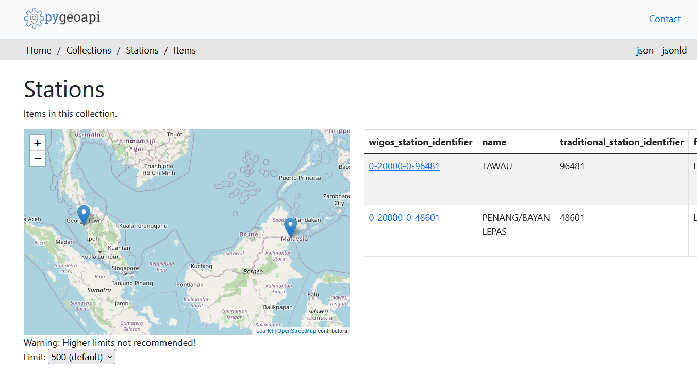

# Configurazione dei metadati delle stazioni

!!! abstract "Risultati di apprendimento"

    Al termine di questa sessione pratica, sarai in grado di:

    - creare un token di autorizzazione per l'endpoint `collections/stations`
    - aggiungere metadati delle stazioni a wis2box
    - aggiornare/eliminare i metadati delle stazioni utilizzando il **wis2box-webapp**

## Introduzione

Per la condivisione internazionale dei dati tra i membri dell'OMM, è importante avere una comprensione comune delle stazioni che producono i dati. Il Sistema Globale Integrato di Osservazione (WIGOS) dell'OMM fornisce un quadro per l'integrazione dei sistemi di osservazione e dei sistemi di gestione dei dati. L'**Identificatore della Stazione WIGOS (WSI)** è utilizzato come riferimento unico della stazione che ha prodotto un determinato set di dati di osservazione.

wis2box ha una collezione di metadati delle stazioni che viene utilizzata per descrivere le stazioni che producono i dati di osservazione e dovrebbe essere recuperata da **OSCAR/Surface**. I metadati delle stazioni in wis2box sono utilizzati dagli strumenti di trasformazione BUFR per verificare che i dati di input contengano un Identificatore della Stazione WIGOS (WSI) valido e per fornire una mappatura tra il WSI e i metadati della stazione.

## Creare un token di autorizzazione per collections/stations

Per modificare le stazioni tramite il **wis2box-webapp** dovrai prima creare un token di autorizzazione.

Accedi alla tua VM studente e assicurati di essere nella directory `wis2box-1.0.0rc1`:

```bash
cd ~/wis2box-1.0.0rc1
```

Poi accedi al contenitore **wis2box-management** con il seguente comando:

```bash
python3 wis2box-ctl.py login
```

All'interno del contenitore **wis2box-management** puoi creare un token di autorizzazione per un endpoint specifico usando il comando: `wis2box auth add-token --path <my-endpoint>`.

Ad esempio, per utilizzare un token generato automaticamente casuale per l'endpoint `collections/stations`:

```{.copy}
wis2box auth add-token --path collections/stations
```

L'output sarà il seguente:

```{.copy}
Continua con il token: 7ca20386a131f0de384e6ffa288eb1ae385364b3694e47e3b451598c82e899d1 [y/N]? y
Token creato con successo
```

Oppure, se vuoi definire il tuo token per l'endpoint `collections/stations`, puoi usare il seguente esempio:

```{.copy}
wis2box auth add-token --path collections/stations DataIsMagic
```

Output:
    
```{.copy}
Continua con il token: DataIsMagic [y/N]? y
Token creato con successo
```

Per favore, crea un token di autorizzazione per l'endpoint `collections/stations` seguendo le istruzioni sopra.

## Aggiungere metadati delle stazioni utilizzando il **wis2box-webapp**

Il **wis2box-webapp** fornisce un'interfaccia grafica per modificare i metadati delle stazioni.

Apri il **wis2box-webapp** nel tuo browser navigando a `http://<your-host>/wis2box-webapp`:


E seleziona le stazioni:


Quando fai clic su 'aggiungi nuova stazione' ti verrà chiesto di fornire l'identificatore della stazione WIGOS per la stazione che vuoi aggiungere:


!!! note "Aggiungi metadati delle stazioni per 3 o più stazioni"
    Aggiungi tre o più stazioni alla collezione di metadati delle stazioni di wis2box. 
      
    Se possibile, utilizza stazioni del tuo paese, specialmente se hai portato i tuoi dati.
      
    Se il tuo paese non ha stazioni in OSCAR/Surface, puoi utilizzare le seguenti stazioni per lo scopo di questo esercizio:

      - 0-20000-0-91334
      - 0-20000-0-96323 (nota l'assenza dell'elevazione della stazione in OSCAR)
      - 0-20000-0-96749 (nota l'assenza dell'elevazione della stazione in OSCAR)

Quando fai clic su cerca, i dati della stazione vengono recuperati da OSCAR/Surface, si prega di notare che questo può richiedere alcuni secondi.

Rivedi i dati restituiti da OSCAR/Surface e aggiungi i dati mancanti dove necessario. Seleziona un argomento per la stazione e fornisci il tuo token di autorizzazione per l'endpoint `collections/stations` e fai clic su 'salva':


Torna alla lista delle stazioni e vedrai la stazione che hai aggiunto:


Ripeti questo processo fino a quando non avrai configurato almeno 3 stazioni.

!!! tip "Derivazione delle informazioni sull'elevazione mancante"

    Se mancano le informazioni sull'elevazione della tua stazione, ci sono servizi online che aiutano a cercare l'elevazione utilizzando dati di elevazione aperti. Un esempio è l'[API di Open Topo Data](https://www.opentopodata.org).

    Ad esempio, per ottenere l'elevazione alla latitudine -6.15558 e longitudine 106.84204, puoi copiare-incollare il seguente URL in una nuova scheda del browser:

    ```{.copy}
    https://api.opentopodata.org/v1/aster30m?locations=-6.15558,106.84204
    ```

    Output:

    ```{.copy}
    {
      "results": [
        {
          "dataset": "aster30m", 
          "elevation": 7.0, 
          "location": {
            "lat": -6.15558, 
            "lng": 106.84204
          }
        }
      ], 
      "status": "OK"
    }
    ```

## Rivedi i tuoi metadati delle stazioni

I metadati delle stazioni sono memorizzati nel backend di wis2box e resi disponibili tramite il **wis2box-api**.

Se apri un browser e navighi a `http://<your-host>/oapi/collections/stations/items` vedrai i metadati delle stazioni che hai aggiunto:



!!! note "Rivedi i tuoi metadati delle stazioni"

    Verifica che le stazioni che hai aggiunto siano associate al tuo dataset visitando `http://<your-host>/oapi/collections/stations/items` nel tuo browser.

Hai anche l'opzione di visualizzare/aggiornare/eliminare la stazione nel **wis2box-webapp**. Nota che è necessario fornire il tuo token di autorizzazione per l'endpoint `collections/stations` per aggiornare/eliminare la stazione.

!!! note "Aggiorna/elimina i metadati delle stazioni"

    Prova a vedere se puoi aggiornare/eliminare i metadati delle stazioni per una delle stazioni che hai aggiunto utilizzando il **wis2box-webapp**.

## Caricamento in blocco dei metadati delle stazioni

Nota che wis2box ha anche la capacità di eseguire il caricamento "in blocco" dei metadati delle stazioni da un file CSV utilizzando la riga di comando nel contenitore **wis2box-management**.

```bash
python3 wis2box-ctl.py login
wis2box metadata station publish-collection -p /data/wis2box/metadata/station/station_list.csv -th origin/a/wis2/centre-id/weather/surface-based-observations/synop
```

Questo ti permette di caricare un gran numero di stazioni contemporaneamente e associarle a un argomento specifico.

Puoi creare il file CSV utilizzando Excel o un editor di testo e poi caricarlo nella wis2box-host-datadir per renderlo disponibile al contenitore **wis2box-management** nella directory `/data/wis2box/`.

Dopo aver fatto un caricamento in blocco di stazioni, si raccomanda di rivedere le stazioni nel **wis2box-webapp** per assicurarsi che i dati siano stati caricati correttamente.

Consulta la documentazione ufficiale di [wis2box](https://docs.wis2box.wis.wmo.int) per ulteriori informazioni su come utilizzare questa funzionalità.

## Conclusione

!!! success "Congratulazioni!"
    In questa sessione pratica, hai imparato come:

    - creare un token di autorizzazione per l'endpoint `collections/stations` da utilizzare con il **wis2box-webapp**
    - aggiungere metadati delle stazioni a wis2box utilizzando il **wis2box-webapp**
    - visualizzare/aggiornare/eliminare i metadati delle stazioni utilizzando il **wis2box-webapp**