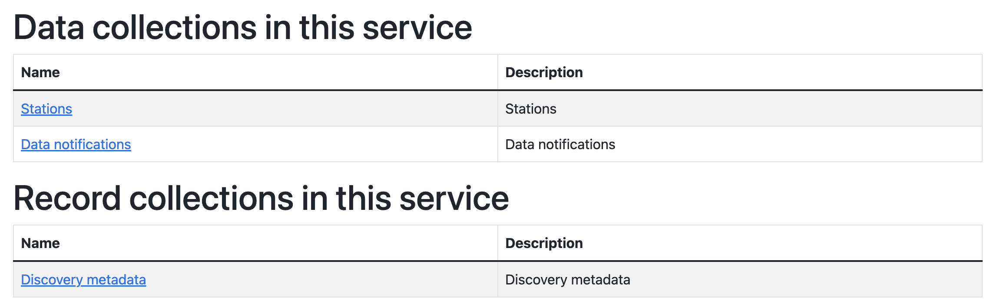

# Inizializzazione di wis2box

!!! abstract "Risultati dell'apprendimento"

    Al termine di questa sessione pratica, sarai in grado di:

    - eseguire lo script `wis2box-create-config.py` per creare la configurazione iniziale
    - avviare wis2box e controllare lo stato dei suoi componenti
    - accedere alla **wis2box-webapp**, API, MinIO UI e dashboard di Grafana tramite un browser
    - connetterti al **wis2box-broker** locale utilizzando MQTT Explorer

!!! note

    I materiali di formazione attuali utilizzano wis2box-1.0.0rc1.
    
    Consulta [accessing-your-student-vm](accessing-your-student-vm.md) per istruzioni su come scaricare e installare il software stack di wis2box se stai eseguendo questa formazione al di fuori di una sessione locale.

## Preparazione

Accedi alla tua VM designata con il tuo username e password e assicurati di trovarti nella directory `wis2box-1.0.0rc1`:

```bash
cd ~/wis2box-1.0.0rc1
```

## Creazione della configurazione iniziale

La configurazione iniziale per wis2box richiede:

- un file di ambiente `wis2box.env` contenente i parametri di configurazione
- una directory sulla macchina host da condividere tra la macchina host e i container wis2box definiti dalla variabile di ambiente `WIS2BOX_HOST_DATADIR`

Lo script `wis2box-create-config.py` può essere utilizzato per creare la configurazione iniziale del tuo wis2box.

Ti verrà chiesto un insieme di domande per aiutarti a configurare il tuo ambiente.

Sarai in grado di rivedere e aggiornare i file di configurazione dopo che lo script sarà completato.

Esegui lo script come segue:

```bash
python3 wis2box-create-config.py
```

### Directory wis2box-host-data

Lo script ti chiederà di inserire la directory da utilizzare per la variabile di ambiente `WIS2BOX_HOST_DATADIR`.

Nota che devi definire il percorso completo di questa directory.

Ad esempio, se il tuo username è `username`, il percorso completo della directory è `/home/username/wis2box-data`:

```{.copy}
username@student-vm-username:~/wis2box-1.0.0rc1$ python3 wis2box-create-config.py
Inserisci la directory da utilizzare per WIS2BOX_HOST_DATADIR:
/home/username/wis2box-data
La directory da utilizzare per WIS2BOX_HOST_DATADIR sarà impostata su:
    /home/username/wis2box-data
È corretto? (s/n/exit)
s
La directory /home/username/wis2box-data è stata creata.
```

### URL di wis2box

Successivamente, ti verrà chiesto di inserire l'URL del tuo wis2box. Questo è l'URL che verrà utilizzato per accedere all'applicazione web wis2box, all'API e all'UI.

Utilizza `http://<il-tuo-hostname-o-ip>` come URL.

```{.copy}
Inserisci l'URL di wis2box:
 Per test locali l'URL è http://localhost
 Per abilitare l'accesso remoto, l'URL dovrebbe puntare all'indirizzo IP pubblico o al nome di dominio del server che ospita wis2box.
http://username.wis2.training
L'URL di wis2box sarà impostato su:
  http://username.wis2.training
È corretto? (s/n/exit)
```

### Password WEBAPP, STORAGE e BROKER

Puoi utilizzare l'opzione di generazione casuale della password quando richiesto per `WIS2BOX_WEBAPP_PASSWORD`, `WIS2BOX_STORAGE_PASSWORD`, `WIS2BOX_BROKER_PASSWORD` e definire la tua.

Non preoccuparti di ricordare queste password, saranno memorizzate nel file `wis2box.env` nella tua directory wis2box-1.0.0rc1.

### Revisione `wis2box.env`

Una volta completato lo script, controlla il contenuto del file `wis2box.env` nella tua directory corrente:

```bash
cat ~/wis2box-1.0.0rc1/wis2box.env
```

Oppure controlla il contenuto del file tramite WinSCP.

!!! question

    Qual è il valore di WISBOX_BASEMAP_URL nel file wis2box.env?

??? success "Clicca per rivelare la risposta"

    Il valore predefinito per WIS2BOX_BASEMAP_URL è `https://{s}.tile.openstreetmap.org/{z}/{x}/{y}.png`.

    Questo URL si riferisce al server di tessere di OpenStreetMap. Se desideri utilizzare un diverso fornitore di mappe, puoi cambiare questo URL per puntare a un diverso server di tessere.

!!! question 

    Qual è il valore della variabile di ambiente WIS2BOX_STORAGE_DATA_RETENTION_DAYS nel file wis2box.env?

??? success "Clicca per rivelare la risposta"

    Il valore predefinito per WIS2BOX_STORAGE_DATA_RETENTION_DAYS è 30 giorni. Puoi cambiare questo valore in un diverso numero di giorni se lo desideri.
    
    Il container di gestione wis2box esegue un lavoro cron giornaliero per rimuovere i dati più vecchi del numero di giorni definito da WIS2BOX_STORAGE_DATA_RETENTION_DAYS dal bucket `wis2box-public` e dal backend API:
    
    ```{.copy}
    0 0 * * * su wis2box -c "wis2box data clean --days=$WIS2BOX_STORAGE_DATA_RETENTION_DAYS"
    ```

!!! note

    Il file `wis2box.env` contiene variabili di ambiente che definiscono la configurazione del tuo wis2box. Per maggiori informazioni consulta la [documentazione di wis2box](https://docs.wis2box.wis.wmo.int/en/latest/reference/configuration.html).

    Non modificare il file `wis2box.env` a meno che tu non sia sicuro delle modifiche che stai apportando. Modifiche errate possono causare il malfunzionamento del tuo wis2box.

    Non condividere il contenuto del tuo file `wis2box.env` con nessuno, poiché contiene informazioni sensibili come le password.


## Avvia wis2box

Assicurati di trovarti nella directory che contiene i file di definizione dello stack software di wis2box:

```{.copy}
cd ~/wis2box-1.0.0rc1
```

Avvia wis2box con il seguente comando:

```{.copy}
python3 wis2box-ctl.py start
```

Quando esegui questo comando per la prima volta, vedrai il seguente output:

```
Non sono stati trovati file docker-compose.images-*.yml, ne verrà creato uno
Versione corrente=Indefinita, ultima versione=1.0.0rc1
Desideri aggiornare? (s/n/exit)
```

Seleziona ``s`` e lo script creerà il file ``docker-compose.images-1.0.0rc1.yml``, scaricherà le immagini Docker richieste e avvierà i servizi.

Il download delle immagini può richiedere del tempo a seconda della velocità della tua connessione internet. Questo passaggio è richiesto solo la prima volta che avvii wis2box.

Ispeziona lo stato con il seguente comando:

```{.copy}
python3 wis2box-ctl.py status
```

Ripeti questo comando fino a quando tutti i servizi non saranno attivi e funzionanti.

!!! note "wis2box e Docker"
    wis2box funziona come un insieme di container Docker gestiti da docker-compose.
    
    I servizi sono definiti nei vari `docker-compose*.yml` che possono essere trovati nella directory `~/wis2box-1.0.0rc1/`.
    
    Lo script Python `wis2box-ctl.py` è utilizzato per eseguire i comandi Docker Compose sottostanti che controllano i servizi wis2box.

    Non è necessario conoscere i dettagli dei container Docker per eseguire lo stack software wis2box, ma puoi ispezionare i file `docker-compose*.yml` per vedere come sono definiti i servizi. Se sei interessato a saperne di più su Docker, puoi trovare ulteriori informazioni nella [documentazione di Docker](https://docs.docker.com/).

Per accedere al container di gestione wis2box, utilizza il seguente comando:

```{.copy}
python3 wis2box-ctl.py login
```

All'interno del container di gestione wis2box puoi eseguire vari comandi per gestire il tuo wis2box, come:

- `wis2box auth add-token --path processes/wis2box` : per creare un token di autorizzazione per l'endpoint `processes/wis2box`
- `wis2box data clean --days=<numero-di-giorni>` : per pulire i dati più vecchi di un certo numero di giorni dal bucket `wis2box-public`

Per uscire dal container e tornare alla macchina host, utilizza il seguente comando:

```{.copy}
exit
```

Esegui il seguente comando per vedere i container docker in esecuzione sulla tua macchina host:

```{.copy}
docker ps
```

Dovresti vedere i seguenti container in esecuzione:

- wis2box-management
- wis2box-api
- wis2box-minio
- wis2box-webapp
- wis2box-auth
- wis2box-ui
- wis2downloader
- elasticsearch
- elasticsearch-exporter
- nginx
- mosquitto
- prometheus
- grafana
- loki

Questi container fanno parte dello stack software di wis2box e forniscono i vari servizi necessari per eseguire wis2box.

Esegui il seguente comando per vedere i volumi docker in esecuzione sulla tua macchina host:

```{.copy}
docker volume ls
```

Dovresti vedere i seguenti volumi:

- wis2box_project_auth-data
- wis2box_project_es-data
- wis2box_project_htpasswd
- wis2box_project_minio-data
- wis2box_project_prometheus-data
- wis2box_project_loki-data

Oltre ad alcuni volumi anonimi utilizzati dai vari container.

I volumi che iniziano con `wis2box_project_` sono utilizzati per memorizzare dati persistenti per i vari servizi nello stack software di wis2box.

## API di wis2box

wis2box contiene un'API (Interfaccia di Programmazione Applicativa) che fornisce accesso ai dati e processi per la visualizzazione interattiva, la trasformazione dei dati e la pubblicazione.

Apri una nuova scheda e naviga alla pagina `http://<il-tuo-host>/oapi`.


Questa è la pagina di atterraggio dell'API di wis2box (in esecuzione tramite il container **wis2box-api**).

!!! question
     
     Quali collezioni sono attualmente disponibili?

??? success "Clicca per rivelare la risposta"
    
    Per visualizzare le collezioni attualmente disponibili tramite l'API, clicca su `Visualizza le collezioni in questo servizio`:

    

    Le seguenti collezioni sono attualmente disponibili:

    - Stazioni
    - Notifiche di dati
    - Metadati di scoperta


!!! question

    Quante notifiche di dati sono state pubblicate?

??? success "Clicca per rivelare la risposta"

    Clicca su "Notifiche di dati", poi clicca su `Sfoglia gli elementi di "Notifiche di dati"`. 
    
    Noterai che la pagina dice "Nessun elemento" poiché non sono state ancora pubblicate notifiche di dati.

## wis2box webapp

Apri un browser web e visita la pagina `http://<il-tuo-host>/wis2box-webapp`.

Vedrai apparire un pop-up che chiede il tuo username e password. Utilizza l'username predefinito `wis2box-user` e la `WIS2BOX_WEBAPP_PASSWORD` definita nel file `wis2box.env` e clicca su "Accedi":

!!! note 

    Controlla il tuo wis2box.env per il valore della tua WIS2BOX_WEBAPP_PASSWORD. Puoi utilizzare il seguente comando per controllare il valore di questa variabile di ambiente:

    ```{.copy}
    cat ~/wis2box-1.0.0rc1/wis2box.env | grep WIS2BOX_WEBAPP_PASSWORD
    ```

Una volta effettuato l'accesso, muovi il mouse sul menu a sinistra per vedere le opzioni disponibili nell'applicazione web wis2box:


Questa è l'applicazione web wis2box che ti permette di interagire con il tuo wis2box:

- creare e gestire dataset
- aggiornare/rivedere i metadati della tua stazione
- inserire dati ASCII e CSV
- monitorare le notifiche pubblicate sul tuo wis2box-broker

Utilizzeremo questa applicazione web in una sessione successiva.

## wis2box-broker

Apri MQTT Explorer sul tuo computer e prepara una nuova connessione per connetterti al tuo broker (in esecuzione tramite il container **wis2box-broker**).

Clicca su `+` per aggiungere una nuova connessione:


Puoi cliccare sul pulsante 'AVANZATE' e verificare di avere sottoscrizioni ai seguenti argomenti:

- `#`
- `$SYS/#`


!!! note

    L'argomento `#` è una sottoscrizione jolly che si iscriverà a tutti gli argomenti pubblicati sul broker.

    I messaggi pubblicati sotto l'argomento `$SYS` sono messaggi di sistema pubblicati dal servizio mosquitto stesso.

Utilizza i seguenti dettagli di connessione, assicurandoti di sostituire il valore di `<il-tuo-host>` con il tuo hostname e `<WIS2BOX_BROKER_PASSWORD>` con il valore dal tuo file `wis2box.env`:

- **Protocollo: mqtt://**
- **Host: `<il-tuo-host>`**
- **Porta: 1883**
- **Username: wis2box**
- **Password: `<WIS2BOX_BROKER_PASSWORD>`**

!!! note 

    Puoi controllare il tuo wis2box.env per il valore della tua WIS2BOX_BROKER_PASSWORD. Puoi utilizzare il seguente comando per controllare il valore di questa variabile di ambiente:

    ```{.copy}
    cat ~/wis2box-1.0.0rc1/wis2box.env | grep WIS2BOX_BROKER_PASSWORD
    ```

    Nota che questa è la tua password **interna** del broker, il Broker Globale utilizzerà credenziali diverse (sola lettura) per iscriversi al tuo broker. Non condividere mai questa password con nessuno.

Assicurati di cliccare su "SALVA" per memorizzare i dettagli della tua connessione.

Poi clicca su "CONNETTI" per connetterti al tuo **wis2box-broker**.


Una volta connesso, verifica che le statistiche interne di mosquitto vengano pubblicate dal tuo broker sotto l'argomento `$SYS`:


Mantieni aperto MQTT Explorer, poiché lo utilizzeremo per monitorare i messaggi pubblicati sul broker.

## MinIO UI

Apri un browser web e visita la pagina `http://<il-tuo-host>:9001`:


Questa è l'interfaccia utente di MinIO (in esecuzione tramite il container **wis2box-storage**).

L'username e la password sono definiti nel file `wis2box.env` nella tua directory dati wis2box dalle variabili di ambiente `WIS2BOX_STORAGE_USERNAME` e `WIS2BOX_STORAGE_PASSWORD`. L'username predefinito è `wis2box`.

!!! note 

    Puoi controllare il tuo wis2box.env per il valore della tua WIS2BOX_STORAGE_PASSWORD. Puoi utilizzare il seguente comando per controllare il valore di questa variabile di ambiente:

    ```{.copy}
    cat ~/wis2box-1.0.0rc1/wis2box.env | grep WIS2BOX_STORAGE_PASSWORD
    ```

    Nota che queste sono le credenziali di lettura/scrittura per la tua istanza MinIO. Non condividere mai queste credenziali con nessuno. I Servizi Globali possono solo scaricare