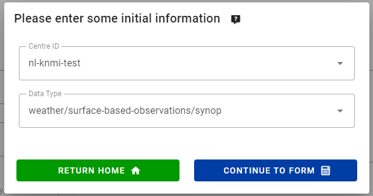
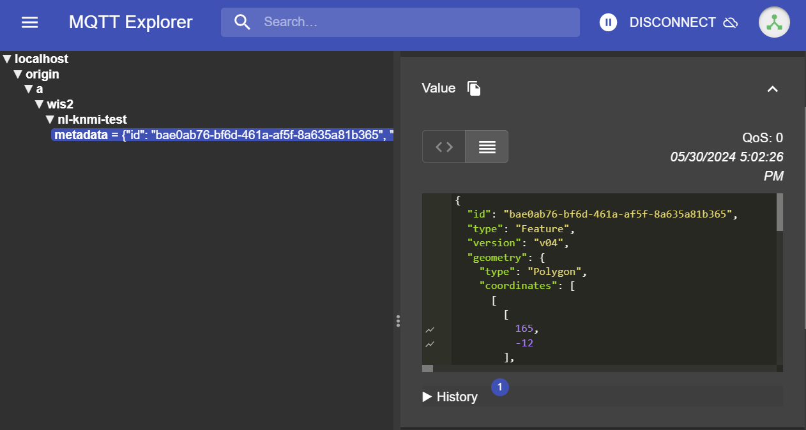

# Настройка наборов данных в wis2box

!!! abstract "Учебные результаты"
    К концу этого практического занятия вы сможете:

    - создать новый набор данных
    - создать метаданные для поиска набора данных
    - настроить сопоставление данных для набора данных
    - опубликовать уведомление WIS2 с записью WCMP2
    - обновить и повторно опубликовать ваш набор данных

## Введение

wis2box использует наборы данных, которые связаны с метаданными для поиска и сопоставлением данных.

Метаданные для поиска используются для создания записи WCMP2 (WMO Core Metadata Profile 2), которая распространяется с помощью уведомления WIS2, опубликованного на вашем брокере wis2box.

Сопоставление данных используется для ассоциации плагина данных с вашими входными данными, что позволяет трансформировать ваши данные перед публикацией с использованием уведомления WIS2.

На этом занятии вы научитесь создавать новый набор данных, создавать метаданные для поиска и настраивать сопоставление данных. Вы осмотрите ваш набор данных в wis2box-api и проверите уведомление WIS2 для ваших метаданных для поиска.

## Подготовка

Подключитесь к вашему брокеру с помощью MQTT Explorer.

Вместо использования ваших внутренних учетных данных брокера используйте публичные учетные данные `everyone/everyone`:


!!! Note

    Вам никогда не нужно делиться учетными данными вашего внутреннего брокера с внешними пользователями. Пользователь 'everyone' является публичным пользователем для обмена уведомлениями WIS2.

    Учетные данные `everyone/everyone` имеют доступ только для чтения к теме 'origin/a/wis2/#'. Это тема, где публикуются уведомления WIS2. Глобальный брокер может подписаться с этими публичными учетными данными для получения уведомлений.
    
    Пользователь 'everyone' не увидит внутренние темы или не сможет публиковать сообщения.
    
Откройте браузер и перейдите на страницу `http://<your-host>/wis2box-webapp`. Убедитесь, что вы вошли в систему и можете получить доступ к странице 'редактор наборов данных'.

См. раздел [Инициализация wis2box](/practical-sessions/initializing-wis2box), если вам нужно вспомнить, как подключиться к брокеру или получить доступ к wis2box-webapp.

## Создание токена авторизации для процессов/wis2box

Вам понадобится токен авторизации для конечной точки 'processes/wis2box', чтобы опубликовать ваш набор данных.

Для создания токена авторизации подключитесь к вашей учебной виртуальной машине по SSH и используйте следующие команды для входа в контейнер управления wis2box:

```bash
cd ~/wis2box-1.0.0rc1
python3 wis2box-ctl.py login
```

Затем выполните следующую команду для создания случайно сгенерированного токена авторизации для конечной точки 'processes/wis2box':

```bash
wis2box auth add-token --path processes/wis2box
```

Вы также можете создать токен с конкретным значением, предоставив токен в качестве аргумента команде:

```bash
wis2box auth add-token --path processes/wis2box MyS3cretToken
```

Убедитесь, что вы скопировали значение токена и сохранили его на вашем локальном компьютере, так как оно вам понадобится позже.

После получения вашего токена вы можете выйти из контейнера управления wis2box:

```bash
exit
```

## Создание нового набора данных в wis2box-webapp

Перейдите на страницу 'редактор наборов данных' в wis2box-webapp вашего экземпляра wis2box, перейдя по адресу `http://<your-host>/wis2box-webapp` и выбрав 'редактор наборов данных' в меню слева.

На странице 'редактор наборов данных', на вкладке 'Datasets', нажмите "Create New ...":


Появится всплывающее окно, в котором вас попросят предоставить:

- **Centre ID** : это аббревиатура агентства (в нижнем регистре и без пробелов), как указано членом WMO, которая идентифицирует центр данных, ответственный за публикацию данных.
- **Data Type**: Тип данных, для которых вы создаете метаданные. Вы можете выбрать между использованием предопределенного шаблона или выбором 'другое'. Если выбрано 'другое', необходимо будет вручную заполнить больше полей.

!!! Note "Centre ID"

    Ваш centre-id должен начинаться с доменной зоны верхнего уровня вашей страны, за которой следует сокращенное название вашей организации (например, `ru-roshydromet`). Centre-id должен быть написан строчными буквами и использовать только буквенно-цифровые символы. В раскрывающемся списке показаны все зарегистрированные на данный момент centre-ids в WIS2, а также любой centre-id, который вы уже создали в wis2box.

!!! Note "Data Type Templates"

    Поле *Data Type* позволяет выбрать из списка шаблонов, доступных в редакторе наборов данных wis2box-webapp. Шаблон предварительно заполняет форму предлагаемыми значениями по умолчанию, подходящими для типа данных. Это включает предлагаемые заголовки и ключевые слова для метаданных и предварительно настроенные плагины данных. Тема будет зафиксирована на теме по умолчанию для типа данных.

    В рамках обучения мы будем использовать тип данных *weather/surface-based-observations/synop*, который включает плагины данных, обеспечивающие трансформацию данных в формат BUFR перед публикацией.

    Если вы хотите публиковать уведомления CAP с помощью wis2box, используйте шаблон *weather/advisories-warnings*. Этот шаблон включает плагин данных, который проверяет, являются ли входные данные действительным уведомлением CAP перед публикацией. Для создания уведомлений CAP и их публикации через wis2box вы можете использовать [CAP Composer](https://github.com/wmo-raf/cap-composer).

Выберите centre-id, подходящий для вашей организации.

Для **Data Type** выберите **weather/surface-based-observations/synop**:



Нажмите *continue to form*, чтобы продолжить, теперь вам будет представлена **Форма редактора наборов данных**.

Поскольку вы выбрали тип данных **weather/surface-based-observations/synop**, форма будет предварительно заполнена некоторыми начальными значениями, связанными с этим типом данных.

## Создание метаданных для поиска

Форма редактора наборов данных позволяет вам предоставить метаданные для поиска вашего набора данных, которые контейнер управления wis2box будет использовать для публикации записи WCMP2.

Поскольку вы выбрали тип данных 'weather/surface-based-observations/synop', форма будет предварительно заполнена некоторыми значениями по умолчанию.

Убедитесь, что вы заменили автогенерируемый 'Local ID' описательным названием для вашего набора данных, например, 'synop-dataset-wis2training':


Просмотрите заголовок и ключевые слова, при необходимости обновите их и предоставьте описание для вашего набора данных.

Обратите внимание, что есть возможности изменить 'WMO Data Policy' с 'core' на 'recommended' или изменить ваш идентификатор метаданных по умолчанию, пожалуйста, оставьте политику данных как 'core' и используйте идентификатор метаданных по умолчанию.

Далее просмотрите раздел, определяющий вашу 'временную информацию' и 'пространственные свойства'. Вы можете настроить ограничивающий прямоугольник, обновив поля 'Северная широта', 'Южная широта', 'Восточная долгота' и 'Западная долгота':


Затем заполните раздел, определяющий 'Контактную информацию поставщика данных':


Наконец, заполните раздел, определяющий 'Информацию о качестве данных':

После того, как вы заполните все разделы, нажмите 'VALIDATE FORM' и проверьте форму на наличие ошибок:


Если есть ошибки, исправьте их и снова нажмите 'VALIDATE FORM'.

Убедитесь, что у вас нет ошибок и что появляется всплывающее окно, указывающее, что ваша форма была проверена:


Затем, перед отправкой вашего набора данных, просмотрите сопоставления данных для вашего набора данных.

## Настройка сопоставления данных

Поскольку вы использовали шаблон для создания вашего набора данных, сопоставления данных были предварительно заполнены стандартными плагинами для типа данных 'weather/surface-based-observations/synop'. Плагины данных используются в wis2box для трансформации данных перед их публикацией с использованием уведомления WIS2.


Обратите внимание, что вы можете нажать на кнопку "update", чтобы изменить настройки для плагина, такие как расширение файла и шаблон файла, пока можете оставить настройки по умолчанию. На последующем занятии вы узнаете больше о BUFR и трансформации данных в формат BUFR.

## Отправка вашего набора данных

Наконец, вы можете нажать 'submit', чтобы опубликовать ваш набор данных.

Вам нужно будет предоставить токен авторизации для 'processes/wis2box', который вы создали ранее. Если вы этого не сделали, вы можете создать новый токен, следуя инструкциям в разделе подготовки.

Убедитесь, что после отправки вашего набора данных вы получите следующее сообщение, указывающее, что набор данных был успешно отправлен:


После того, как вы нажмете 'OK', вы будете перенаправлены на домашнюю страницу редактора наборов данных. Теперь, если вы нажмете на вкладку 'Dataset', вы должны увидеть ваш новый набор данных в списке:


## Просмотр уведомления WIS2 для ваших метаданных для поиска

Перейдите в MQTT Explorer, если вы были подключены к брокеру, вы должны увидеть новое уведомление WIS2, опубликованное по теме `origin/a/wis2/<your-centre-id>/metadata`:



Изучите содержимое уведомления WIS2, которое вы опубликовали. Вы должны увидеть JSON со структурой, соответствующей формату сообщения уведомления WIS (WNM).

!!! question

    По какой теме публикуется уведомление WIS2?

??? success "Нажмите, чтобы увидеть ответ"

    Уведомление WIS2 публикуется по теме `origin/a/wis2/<your-centre-id>/metadata`.

!!! question
    
    Попробуйте найти заголовок, описание и ключевые слова, которые вы предоставили в метаданных для поиска, в уведомлении WIS2. Вы нашли их?

??? success "Нажмите, чтобы увидеть ответ"

    Обратите внимание, что заголовок, описание и ключевые слова, которые вы предоставили в метаданных для поиска, **не** присутствуют в полезной нагрузке уведомления WIS2!
    
    Вместо этого попробуйте посмотреть на каноническую ссылку в разделе "links" в уведомлении WIS2:

    

    Уведомление WIS2 содержит каноническую ссылку на опубликованную запись WCMP2. Если вы скопируете и вставите эту ссылку в браузер, вы загрузите запись WCMP2 и увидите заголовок