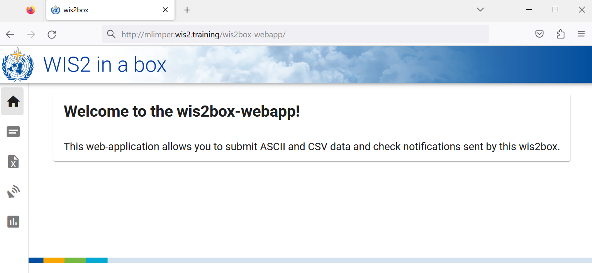
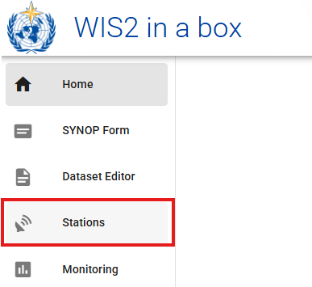
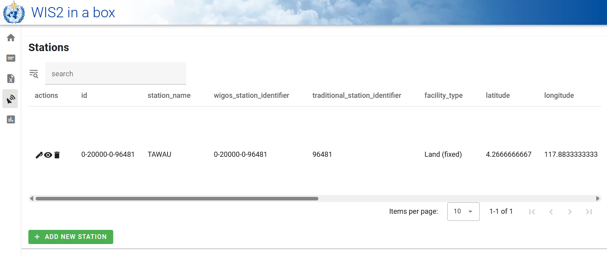

# 配置站点元数据

!!! abstract "学习成果"

    在本实践课程结束时，您将能够：

    - 为 `collections/stations` 端点创建一个授权令牌
    - 向 wis2box 添加站点元数据
    - 使用 **wis2box-webapp** 更新/删除站点元数据

## 引言

为了在世界气象组织（WMO）成员国之间共享数据，了解产生数据的站点至关重要。世界一体化全球观测系统（WIGOS）提供了一个整合观测系统和数据管理系统的框架。**WIGOS 站点标识符（WSI）** 被用作产生特定观测数据集的站点的唯一参考。

wis2box 拥有一个站点元数据集合，用于描述产生观测数据的站点，并应从 **OSCAR/Surface** 检索。wis2box 中的站点元数据被 BUFR 转换工具用来检查输入数据是否包含有效的 WIGOS 站点标识符（WSI）并提供 WSI 与站点元数据之间的映射。

## 为 collections/stations 创建授权令牌

要通过 **wis2box-webapp** 编辑站点，您首先需要创建一个授权令牌。

登录到您的学生 VM 并确保您位于 `wis2box-1.0.0rc1` 目录：

```bash
cd ~/wis2box-1.0.0rc1
```

然后使用以下命令登录到 **wis2box-management** 容器：

```bash
python3 wis2box-ctl.py login
```

在 **wis2box-management** 容器中，您可以使用命令 `wis2box auth add-token --path <my-endpoint>` 为特定端点创建授权令牌。

例如，为 `collections/stations` 端点使用一个随机自动生成的令牌：

```{.copy}
wis2box auth add-token --path collections/stations
```

输出将如下所示：

```{.copy}
Continue with token: 7ca20386a131f0de384e6ffa288eb1ae385364b3694e47e3b451598c82e899d1 [y/N]? y
Token successfully created
```

或者，如果您想为 `collections/stations` 端点定义自己的令牌，可以使用以下示例：

```{.copy}
wis2box auth add-token --path collections/stations DataIsMagic
```

输出：

```{.copy}
Continue with token: DataIsMagic [y/N]? y
Token successfully created
```

请按照上述说明为 `collections/stations` 端点创建一个授权令牌。

## 使用 **wis2box-webapp** 添加站点元数据

**wis2box-webapp** 提供了一个图形用户界面来编辑站点元数据。

通过在浏览器中导航到 `http://<your-host>/wis2box-webapp` 打开 **wis2box-webapp**：



并选择站点：



当您点击“添加新站点”时，您需要提供要添加的站点的 WIGOS 站点标识符：


!!! note "为 3 个或更多站点添加站点元数据"
    请向您的 wis2box 站点元数据集合中添加三个或更多站点。
      
    如果可能，请使用您国家的站点，特别是如果您带来了自己的数据。
      
    如果您的国家在 OSCAR/Surface 中没有任何站点，您可以使用以下站点进行此练习：

      - 0-20000-0-91334
      - 0-20000-0-96323（注意 OSCAR 中缺少站点高程）
      - 0-20000-0-96749（注意 OSCAR 中缺少站点高程）

当您点击搜索时，站点数据将从 OSCAR/Surface 检索，请注意这可能需要几秒钟。

检查 OSCAR/Surface 返回的数据并在需要时添加缺失数据。选择一个站点主题，并为 `collections/stations` 端点提供您的授权令牌，然后点击“保存”：


返回站点列表，您将看到您添加的站点：



重复此过程，直到您配置了至少 3 个站点。

!!! tip "推导缺失的高程信息"

    如果您的站点高程缺失，有在线服务可以帮助使用开放高程数据查找高程。其中一个例子是 [Open Topo Data API](https://www.opentopodata.org)。

    例如，要获取纬度 -6.15558 和经度 106.84204 的高程，您可以在新的浏览器标签页中复制粘贴以下 URL：

    ```{.copy}
    https://api.opentopodata.org/v1/aster30m?locations=-6.15558,106.84204
    ```

    输出：

    ```{.copy}
    {
      "results": [
        {
          "dataset": "aster30m", 
          "elevation": 7.0, 
          "location": {
            "lat": -6.15558, 
            "lng": 106.84204
          }
        }
      ], 
      "status": "OK"
    }
    ```

## 审查您的站点元数据

站点元数据存储在 wis2box 的后端，并通过 **wis2box-api** 提供。

如果您打开浏览器并导航到 `http://<your-host>/oapi/collections/stations/items`，您将看到您添加的站点元数据：


!!! note "审查您的站点元数据"

    通过访问浏览器中的 `http://<your-host>/oapi/collections/stations/items` 验证您添加的站点是否与您的数据集关联。

您还可以在 **wis2box-webapp** 中查看/更新/删除站点。请注意，您需要为 `collections/stations` 端点提供您的授权令牌以更新/删除站点。

!!! note "更新/删除站点元数据"

    尝试使用 **wis2box-webapp** 更新/删除您添加的一个站点的站点元数据。

## 批量上传站点元数据

请注意，wis2box 还能够使用 **wis2box-management** 容器中的命令行从 CSV 文件执行站点元数据的“批量”加载。

```bash
python3 wis2box-ctl.py login
wis2box metadata station publish-collection -p /data/wis2box/metadata/station/station_list.csv -th origin/a/wis2/centre-id/weather/surface-based-observations/synop
```

这允许您一次上传大量站点并将它们与特定主题关联。

您可以使用 Excel 或文本编辑器创建 CSV 文件，然后将其上传到 wis2box-host-datadir 以使其在 `/data/wis2box/` 目录中的 **wis2box-management** 容器中可用。

在进行大量站点上传后，建议在 **wis2box-webapp** 中审查站点以确保数据正确上传。

有关如何使用此功能的更多信息，请参阅官方 [wis2box 文档](https://docs.wis2box.wis.wmo.int)。

## 结论

!!! success "恭喜！"
    在这个实践课程中，您学会了：

    - 为 `collections/stations` 端点创建授权令牌以用于 **wis2box-webapp**
    - 使用 **wis2box-webapp** 向 wis2box 添加站点元数据
    - 使用 **wis2box-webapp** 查看/更新/删除站点元数据