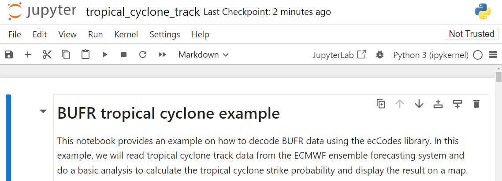

# 从 WIS2 下载和解码数据

!!! abstract "学习成果！"

    在本实践课程结束时，您将能够：

    - 使用“wis2downloader”订阅 WIS2 数据通知并将数据下载到您的本地系统
    - 在 Grafana 仪表板中查看下载状态
    - 使用“decode-bufr-jupyter”容器解码一些下载的数据

## 引言

在本课程中，您将学习如何设置订阅到 WIS2 Broker 并使用 wis2box 中包含的“wis2downloader”服务自动下载数据到您的本地系统。

!!! note "关于 wis2downloader"
     
     wis2downloader 也可以作为独立服务在发布 WIS2 通知的系统之外的不同系统上运行。请访问 [wis2downloader](https://pypi.org/project/wis2downloader/) 了解更多关于将 wis2downloader 作为独立服务使用的信息。

     如果您想开发自己的服务来订阅 WIS2 通知并下载数据，您可以使用 [wis2downloader 源代码](https://github.com/wmo-im/wis2downloader) 作为参考。

!!! Other tools for accessing WIS2 data

    以下工具也可以用来发现和访问 WIS2 的数据：

    - [pywiscat](https://github.com/wmo-im/pywiscat) 提供了在 WIS2 全球发现目录上的搜索功能，支持报告和分析 WIS2 目录及其相关的发现元数据
    - [pywis-pubsub](https://github.com/wmo-im/pywis-pubsub) 提供了从 WIS2 基础设施服务订阅和下载 WMO 数据的功能

## 准备工作

开始之前，请登录到您的学生 VM 并确保您的 wis2box 实例正在运行。

## 练习 1：在 Grafana 中查看 wis2download 仪表板

打开一个网页浏览器，通过访问 `http://<your-host>:3000` 导航到您的 wis2box 实例的 Grafana 仪表板。

点击左侧菜单中的仪表板，然后选择 **wis2downloader 仪表板**。

您应该会看到以下仪表板：


此仪表板基于 wis2downloader 服务发布的指标，将显示当前正在进行的下载状态。

在左上角您可以看到当前激活的订阅。

保持此仪表板打开，因为您将在下一个练习中使用它来监控下载进度。

## 练习 2：审查 wis2downloader 配置

wis2box 堆栈启动的 wis2downloader 服务可以使用在您的 wis2box.env 文件中定义的环境变量进行配置。

wis2downloader 使用以下环境变量：

    - DOWNLOAD_BROKER_HOST：连接的 MQTT 代理的主机名。默认为 globalbroker.meteo.fr
    - DOWNLOAD_BROKER_PORT：连接的 MQTT 代理的端口。默认为 443（用于 websockets 的 HTTPS）
    - DOWNLOAD_BROKER_USERNAME：用于连接 MQTT 代理的用户名。默认为 everyone
    - DOWNLOAD_BROKER_PASSWORD：用于连接 MQTT 代理的密码。默认为 everyone
    - DOWNLOAD_BROKER_TRANSPORT：websockets 或 tcp，用于连接 MQTT 代理的传输机制。默认为 websockets
    - DOWNLOAD_RETENTION_PERIOD_HOURS：下载数据的保留期（小时）。默认为 24
    - DOWNLOAD_WORKERS：使用的下载工作数。默认为 8。决定并行下载的数量。
    - DOWNLOAD_MIN_FREE_SPACE_GB：在托管下载的卷上保留的最小空闲空间（GB）。默认为 1。

要审查 wis2downloader 的当前配置，您可以使用以下命令：

```bash
cat ~/wis2box-1.0.0rc1/wis2box.env | grep DOWNLOAD
```

!!! question "审查 wis2downloader 的配置"
    
    wis2downloader 默认连接的 MQTT 代理是什么？

    下载数据的默认保留期是多少？

??? success "点击以显示答案"

    wis2downloader 默认连接的 MQTT 代理是 `globalbroker.meteo.fr`。

    下载数据的默认保留期是 24 小时。

!!! note "更新 wis2downloader 的配置"

    要更新 wis2downloader 的配置，您可以编辑 wis2box.env 文件。要应用更改，您可以重新运行 wis2box 堆栈的启动命令：

    ```bash
    python3 wis2box-ctl.py start
    ```

    然后您将看到 wis2downloader 服务使用新配置重新启动。

您可以保持默认配置以进行此练习。

## 练习 3：向 wis2downloader 添加订阅

在 **wis2downloader** 容器内部，您可以使用命令行列出、添加和删除订阅。

要登录到 **wis2downloader** 容器，请使用以下命令：

```bash
python3 wis2box-ctl.py login wis2downloader
```

然后使用以下命令列出当前激活的订阅：

```bash
wis2downloader list-subscriptions
```

此命令返回一个空列表，因为当前没有激活的订阅。

为了本练习的目的，我们将订阅以下主题 `cache/a/wis2/de-dwd-gts-to-wis2/#`，以订阅由 DWD 托管的 GTS-to-WIS2 网关发布的数据和来自 Global Cache 的下载通知。

要添加此订阅，请使用以下命令：

```bash
wis2downloader add-subscription --topic cache/a/wis2/de-dwd-gts-to-wis2/#
```

然后通过输入 `exit` 退出 **wis2downloader** 容器：

```bash
exit
```

检查 Grafana 中的 wis2downloader 仪表板以查看已添加的新订阅。等待几分钟，您应该会看到首次下载开始。一旦确认下载已开始，请进行下一个练习。

## 练习 4：查看下载的数据

wis2box 堆栈中的 wis2downloader 服务将数据下载到您在 wis2box.env 文件中定义的 WIS2BOX_HOST_DATADIR 目录中的 'downloads' 目录。要查看 downloads 目录的内容，您可以使用以下命令：

```bash
ls -R ~/wis2box-data/downloads
```

请注意，下载的数据存储在以 WIS2 通知发布的主题命名的目录中。

## 练习 5：从 wis2downloader 中删除订阅

接下来，重新登录到 wis2downloader 容器：

```bash
python3 wis2box-ctl.py login wis2downloader
```

并使用以下命令从 wis2downloader 中删除您添加的订阅：

```bash
wis2downloader remove-subscription --topic cache/a/wis2/de-dwd-gts-to-wis2/#
```

然后通过输入 `exit` 退出 wis2downloader 容器：
    
```bash
exit
```

检查 Grafana 中的 wis2downloader 仪表板以查看已删除的订阅。您应该会看到下载停止。

## 练习 6：订阅 wis2training-broker 并设置新订阅

在下一个练习中，我们将订阅 wis2training-broker。

这演示了如何订阅非默认代理，并将允许您下载来自 WIS2 培训代理的一些数据。

编辑 wis2box.env 文件并将 DOWNLOAD_BROKER_HOST 更改为 `wis2training-broker.wis2dev.io`，将 DOWNLOAD_BROKER_PORT 更改为 `1883` 并将 DOWNLOAD_BROKER_TRANSPORT 更改为 `tcp`：

```copy
# downloader settings
DOWNLOAD_BROKER_HOST=wis2training-broker.wis2dev.io
DOWNLOAD_BROKER_PORT=1883
DOWNLOAD_BROKER_USERNAME=everyone
DOWNLOAD_BROKER_PASSWORD=everyone
# download transport mechanism (tcp or websockets)
DOWNLOAD_BROKER_TRANSPORT=tcp
```

然后重新启动 wis2box 堆栈以应用更改：

```bash
python3 wis2box-ctl.py start
```

检查 wis2downloader 的日志以查看是否成功连接到新代理：

```bash
docker logs wis2downloader
```

您应该会看到以下日志消息：

```copy
...
INFO - Connecting...
INFO - Host: wis2training-broker.wis2dev.io, port: 1883
INFO - Connected successfully
```

现在我们将设置一个新订阅，以从 WIS2 培训代理下载飓风路径数据。

登录到 **wis2downloader** 容器：

```bash
python3 wis2box-ctl.py login wis2downloader
```

并执行以下命令（复制粘贴以避免打字错误）：

```bash
wis2downloader add-subscription --topic origin/a/wis2/int-wis2-training/data/core/weather/prediction/forecast/medium-range/probabilistic/trajectory
```

通过输入 `exit` 退出 **wis2downloader** 容器。

等到您在 Grafana 中的 wis2downloader 仪表板上看到下载开始。

!!! note "从 WIS2 培训代理下载数据"

    WIS2 培训代理是用于培训目的的测试代理，可能不会一直发布数据。

    在面对面的培训课程中，当地培训师将确保 WIS2 培训代理为您发布数据以供下载。

    如果您在培训课程之外进行此练习，您可能不会看到任何正在下载的数据。

通过再次检查 wis2downloader 的日志来确认数据已下载：

```bash
docker logs wis2downloader
```

您应该会看到类似以下的日志消息：

```copy
[...] INFO - Message received under topic origin/a/wis2/int-wis2-training/data/core/weather/prediction/forecast/medium-range/probabilistic/trajectory
[...] INFO - Downloaded A_JSXX05ECEP020000_C_ECMP_...
```

## 练习 7：解码下载的数据

为了演示如何解码下载的数据，我们将使用 'decode-bufr-jupyter' 映像启动一个新容器。

此容器将在您的实例上启动 Jupyter 笔记本服务器，其中包括您可以用来解码 BUFR 数据的“ecCodes”库。

我们将使用 `~/exercise-materials/notebook-examples` 中包含的示例笔记本来解码飓风路径的下载数据。

要启动容器，请使用以下命令：

```bash
docker run -d --name decode-bufr-jupyter \
    -v ~/wis2box-data/downloads:/root/downloads \
    -p 8888:8888 \
    -e JUPYTER_TOKEN=dataismagic! \
    mlimper/decode-bufr-jupyter
```

!!! note "关于 decode-bufr-jupyter 容器"

    `decode-bufr-jupyter` 容器是一个自定义容器，其中包含 ecCodes 库并运行 Jupyter 笔记本服务器。该容器基于一个包含用于解码 BUFR 数据的 `ecCodes` 库以及用于绘图和数据分析的库的映像。

    上述命令以分离模式启动容器，名称为 `decode-bufr-jupyter`，端口 8888 映射到主机系统，环境变量 `JUPYTER_TOKEN` 设置为 `dataismagic!`。
    
    上述命令还将 `~/wis2box-data/downloads` 目录挂载到容器中的 `/root/downloads`。这确保了下载的数据可用于 Jupyter 笔记本服务器。
    
容器启动后，您可以通过在网页浏览器中导航到 `http://<your-host>:8888` 来访问 Jupyter 笔记本服务器。

您将看到一个请求您输入“密码或令牌”的屏幕。

提供令牌 `dataismagic!` 登录到 Jupyter 笔记本服务器。

登录后，您应该会看到以下屏幕，列出了容器中的目录：


双击 `example-notebooks` 目录将其打开。

您应该会看到以下屏幕，列出了示例笔记本，双击 `tropical_cyclone_track.ipynb` 笔记本将其打开：


现在您应该进入了解码热带飓风路径数据的 Jupyter 笔记本：



阅读笔记本中的说明并运行单元格以解码热带飓风路径的下载数据。通过点击单元格然后点击工具栏中的运行按钮或按 `Shift+Enter` 运行每个单元格。

最后您应该会看到热带飓风路径的打击概率图：


!!! question 

    结果显示了 200 公里内热带风暴路径的预测概率。您将如何更新笔记本以显示 300 公里内热带风暴路径的预测概率？

??? success "点击以显示答案"

    要更新笔记本以显示不同距离内热带风暴路径的预测概率，您可以更新计算打击概率的代码块中的 `distance_threshold` 变量。

    要显示 300 公里内热带风暴路径的预测概率，

    ```python
    # 设置距离阈值（米）
    distance_threshold = 300000  # 300 公里转换为米
    ```

    然后重新运行笔记本中的单元格以查看更新的图表。

!!! note "解码 BUFR 数据"

    您刚刚完成的练习提供了一个具体示例，说明您如何使用 ecCodes 库解码 BUFR 数据。不同的数据类型可能需要不同的解码步骤，您可能需要参考您正在处理的数据类型的文档。
    
    有关更多信息，请参阅 [ecCodes 文档](https://confluence.ecmwf.int/display/ECC)。


## 结论

!!! success "恭喜！"

    在这个实践课程中，您学习了如何：

    - 使用 'wis2downloader' 订阅 WIS2 Broker 并将数据下载到您的本地系统
    - 在 Grafana 仪表板中查看下载状态
    - 使用 'decode-bufr-jupyter' 容器解码一些下载的数据